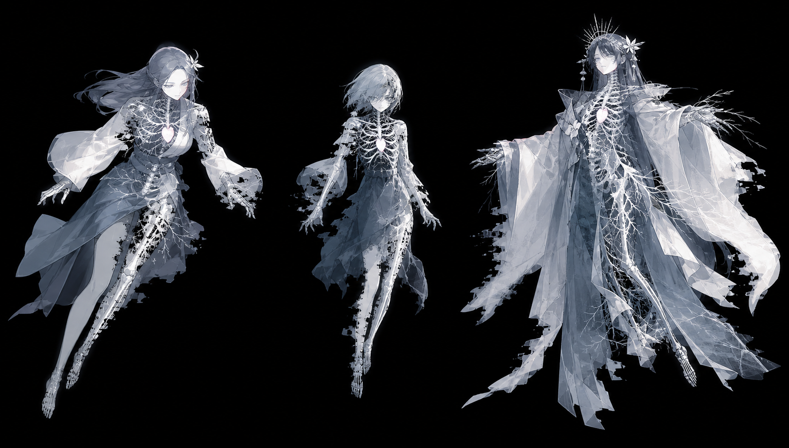

# Danmaku

A deterministic browser bullet-hell shooter built with three.js.

**[Play online →](https://danmaku.t-h-e-s-p-a-c-e.com/)**
· [Vercel mirror](https://danmaku-ebon.vercel.app/)

**Input:** keyboard + mouse or standard controller / gamepad · touch controls are not implemented



The active v4 edition, **余白御寮 / THE NEGATIVE-SPACE WARD**, is an original
four-stage campaign built around reproducible runs and a negative-space visual
language. It runs in a desktop browser with no installation and can optionally
be installed as an offline-capable PWA.

## Highlights

- Four stages, sixteen enemy types, five bosses, and a complete ending.
- Five playable characters, each with a distinct shot, option formation, and
  identity bomb.
- Easy, Normal, Hard, and Lunatic patterns, plus an explicit infinite-lives
  assist.
- A fixed-60 Hz simulation, seeded randomness, and opt-in tick-by-tick replay
  recording for reproducible runs.
- Instanced three.js rendering, authored shader scenes, and project-owned art,
  music, and sound.
- An installable production build that precaches the browser bundle and
  shippable pack tree for offline play.

## Controls

| Action | Keyboard | Mouse | Controller / gamepad |
|---|---|---|---|
| Move / navigate | Arrow keys | Move to a field position / click a menu row | Left stick / D-pad |
| Shoot / confirm / advance dialogue | `Z` | — | A / Cross |
| Bomb / cancel | `X` | — | B / Circle or X / Square |
| Focus | `Shift` | — | Shoulder button / trigger |
| Start / pause / confirm | `Space` | — | Start / Options |
| Save screenshot | `C` | Pause menu: TAKE SCREENSHOT | — |

Focus slows movement, switches to the character's focused weapon, reveals the
lethal hit point, and widens item pickup.

Mouse steering and keyboard actions can be used together. Cursor coordinates
are converted to fixed-tick digital directions before they reach the game, so
recordings remain ordinary button-mask replays.

Turn **RECORD REPLAY** on from **RUN SETUP** before choosing a character to save
that attempt locally under **REPLAYS** on the title screen. The switch defaults
to off. When it is on, natural clears and failures save full stages; quitting or
retrying from the pause menu saves the exact partial run as **QUIT** or
**RETRIED**. A replay session keeps every stage of one campaign attempt
together; sessions can be watched stage by stage, downloaded as JSON, or
imported from an existing session or legacy single-run replay file. A saved
session can also be permanently deleted from its detail screen after a
confirmation step. Each saved stage offers
**EXPORT … VIDEO**: the game replays that stage in real time and downloads a
480×640 recording with its mixed music and sound effects. The browser chooses
WebM or MP4 from the codecs it actually supports; keep the tab visible until
the one-second audio tail has finalized.

On macOS, browsers that provide WebHID offer **CONNECT CONTROLLER** on the title
screen whenever no ordinary Gamepad API controller is already connected. It is
a direct Bluetooth fallback for the Xbox One S Wireless Controller
(`045e:02fd`): select the controller once in the browser's chooser, then press a
controller button to confirm input. The ordinary Gamepad API remains the
default and supports other compatible controllers without this fallback.

## Local development

[Bun](https://bun.sh/) is required; this repository uses `bun.lock`.

```bash
git clone https://github.com/aaajiao/Danmaku.git
cd Danmaku
bun install
bun run dev        # http://localhost:3000
```

Create the production build with:

```bash
bun run build      # → dist/
```

The generated `dist/` directory is ignored by Git. It contains the static game,
the v4 presentation pack, and the generated PWA release.

## Verification

Run the checks before treating a change as complete:

```bash
bun run typecheck
bun run typecheck:tools
bun test
bun run build
```

The headless test suite has no GL context. Rendering work also needs the game in
a real browser and, where relevant, one of these visual harnesses:

```bash
bun run test:visual    # layer ordering by pixel readback
bun run test:assets    # atlas loading, padding, and sprite geometry
bun run test:density   # bullet readability under load
bun run test:scenes    # every background scene and cross-fade
```

## Deployment

Production tracks the GitHub `main` branch through Vercel's Git integration.
Vercel installs with Bun, runs `bun run build`, and publishes `dist/` as
configured in [`vercel.json`](./vercel.json).

- Primary URL: [danmaku.t-h-e-s-p-a-c-e.com](https://danmaku.t-h-e-s-p-a-c-e.com/)
- Vercel URL: [danmaku-ebon.vercel.app](https://danmaku-ebon.vercel.app/)

## Architecture

The simulation is frame-locked: one tick is one tick, and every gameplay speed
is expressed in pixels per tick. A fixed 60 Hz accumulator drives the
simulation; interpolation stays in the renderer. Input is sampled once per tick,
and gameplay randomness comes from a seeded stream separate from cosmetic
effects.

Together, those rules make a run reproducible from its seed and input log.
`src/sim/`, `src/content/`, `src/game/`, and `src/v4/gameplay/` therefore import
no renderer values, keeping the simulation headless and testable. The hard rules
and the failures behind them are documented in [`CLAUDE.md`](./CLAUDE.md).

There are two deliberately different v4 surfaces:

- [`src/v4/`](./src/v4/) is the compile-time edition: executable patterns and
  behaviours, authored shaders and audio identity, and generated campaign data.
- [`packs/v4/`](./packs/v4/) is the runtime-loaded, data-only presentation pack:
  project-owned atlases, HUD art, music, and sound. It cannot inject TypeScript,
  JavaScript, or GLSL.

The generic registries, simulation, game rules, and renderer stay outside both
edition-specific content roots.

## Project structure

```text
src/core/          loop, input, seeded RNG, object pool, exact trigonometry
src/sim/           motion DSL, collision, entities, items, effects, replay
src/game/          run rules, state machine, and screens; no three.js
src/render/        three.js rendering, atlases, layers, backgrounds, post FX
src/content/       generic pattern primitives and content registries
src/v4/            active edition gameplay, shaders, audio, and campaign data
src/audio/         sound and music registries plus runtime synthesis
src/packs/         data-pack validation, injection, and loading
packs/v4/          project-owned v4 presentation pack
public/            PWA manifest, service-worker template, and generated icons
test/visual/       checks that require a real framebuffer
tools/             content, art, audio, build, and fixture tooling
src/main.ts        browser shell: input in, pixels out
docs/              extension, asset, audio, and edition guides
```

## Extending and documentation

| Goal | Read |
|---|---|
| Understand the non-negotiable engine rules | [`CLAUDE.md`](./CLAUDE.md) |
| Add gameplay, patterns, enemies, bosses, stages, backgrounds, art, or 3D content | [`docs/extending.md`](./docs/extending.md) |
| Build data-only presentation and content packs | [`docs/packs.md`](./docs/packs.md) |
| Author images, atlases, animation strips, and other visual assets | [`docs/assets.md`](./docs/assets.md) |
| Work on sound, music, mixing, or runtime audio | [`docs/audio.md`](./docs/audio.md) |
| Understand the compiled-edition / runtime-pack boundary | [`src/v4/README.md`](./src/v4/README.md) |
| Inspect the shipped v4 presentation pack | [`packs/v4/README.md`](./packs/v4/README.md) |
| Follow the v4 visual direction | [`docs/v4-art-direction.md`](./docs/v4-art-direction.md) |
| Follow the v4 score and sound direction | [`docs/v4-audio-direction.md`](./docs/v4-audio-direction.md) |

## Origins and licensing

Danmaku was informed by studying
[toho-like-js](https://github.com/takahirox/toho-like-js) at commit `8ff780d`
(2017-06-13), chiefly its polar motion DSL. It is not a port. No upstream code,
art, or audio is included in this repository or its Git history; all shipped
game assets are original, project-owned work.

Licensing and provenance are documented in [`LICENSE`](./LICENSE),
[`NOTICE`](./NOTICE), and the
[v4 presentation-pack notice](./packs/v4/README.md).
