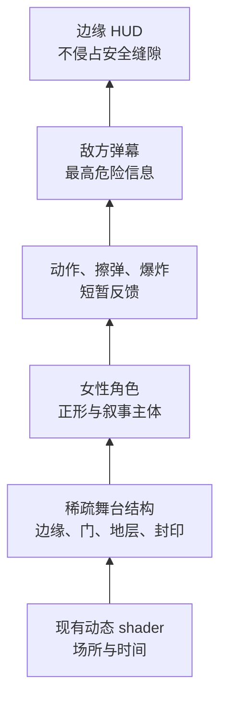
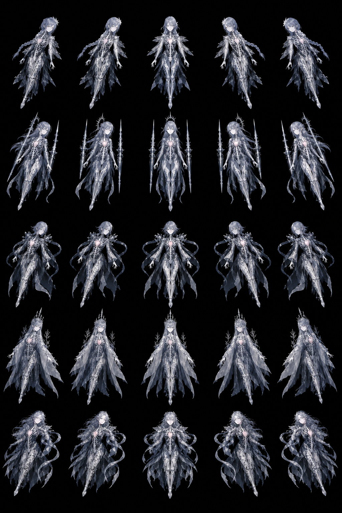
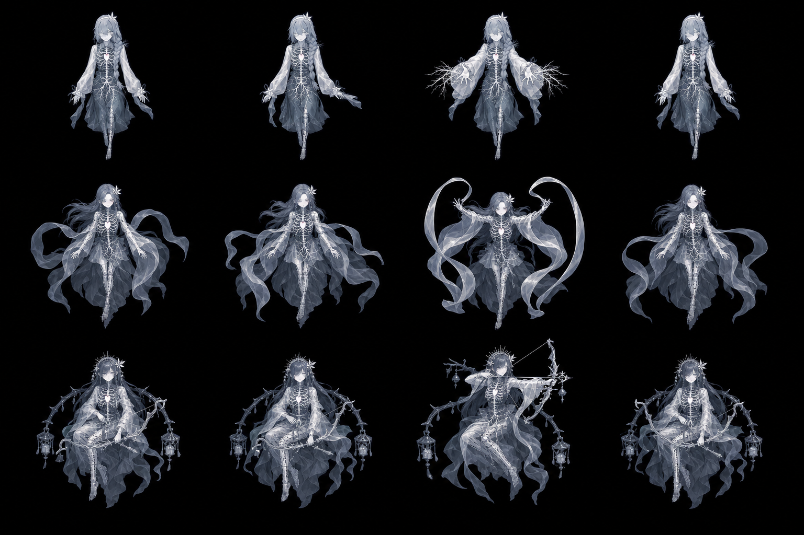
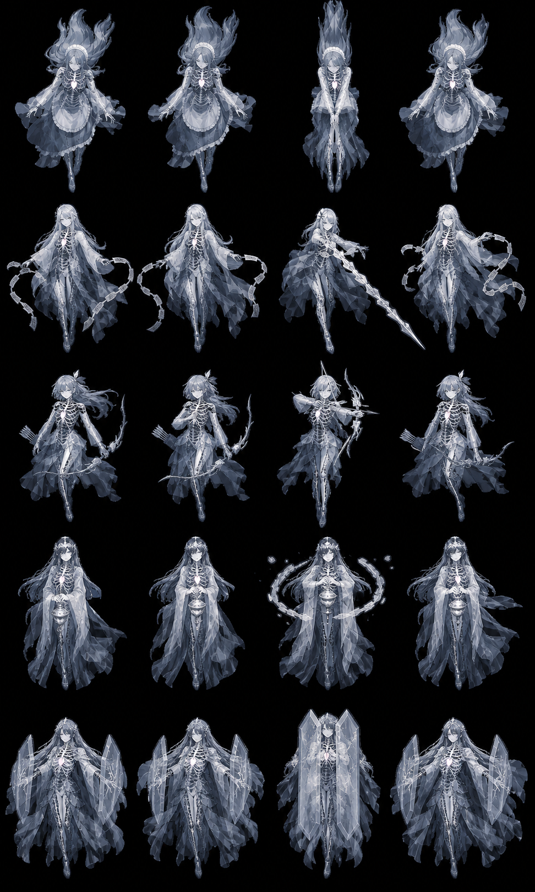
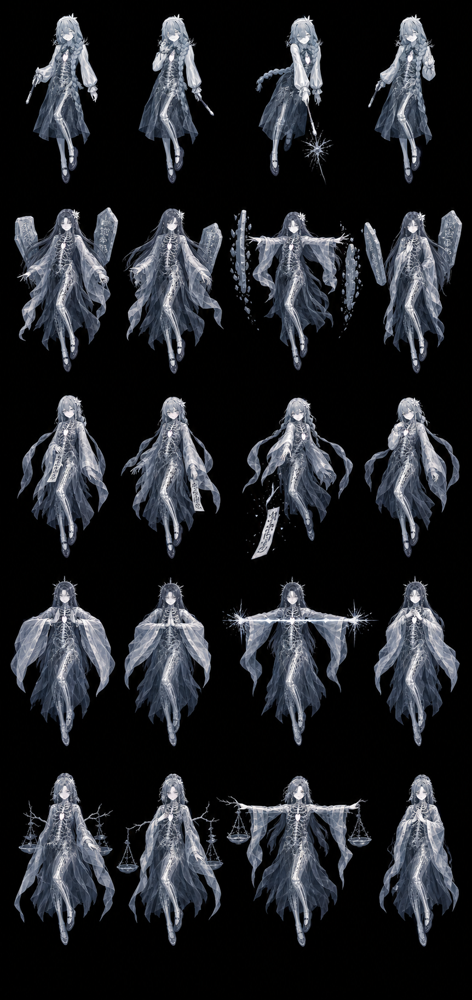
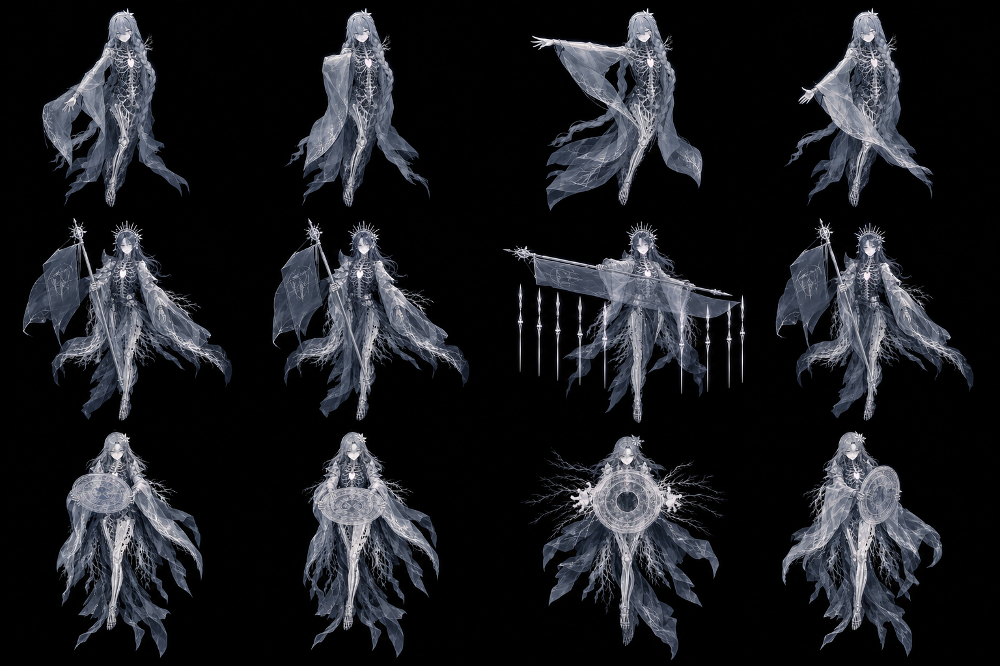
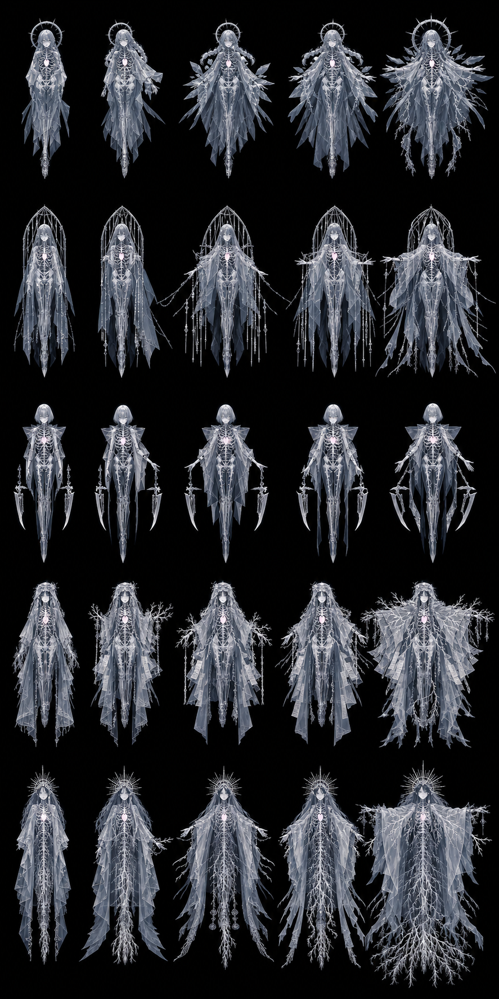
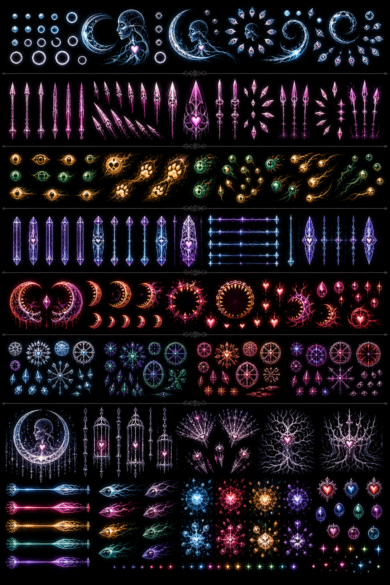
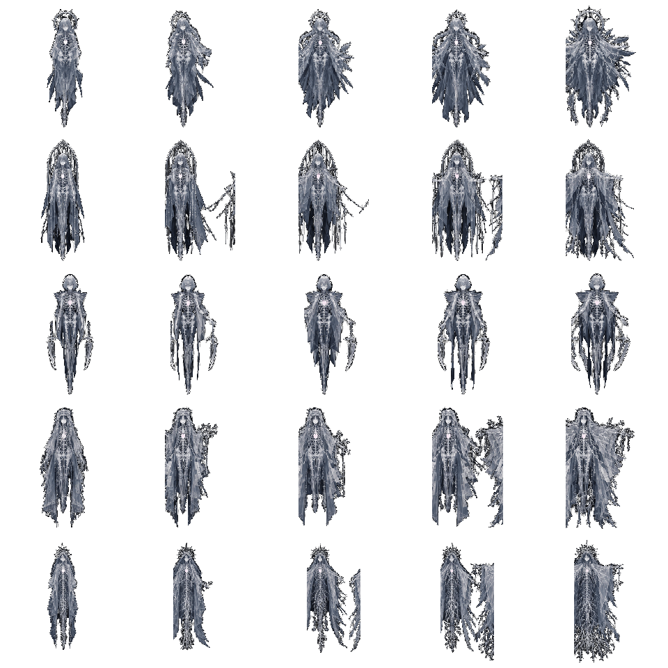
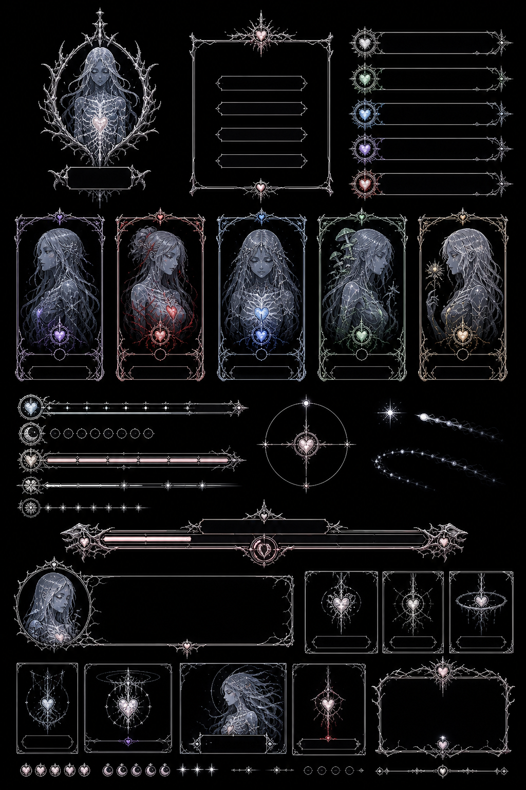

# v4 美术设计总纲：余白御寮

> 状态：**v4 实施起点 / 视觉与技术共同约束**
>
> 日期：2026-07-22
> 适用范围：五位可选主角、16 类敌人、5 位 Boss、四关舞台、项目自有 `packs/v4` 弹幕/特效/UI，以及已购买 BulletPack 的本地兼容参考

v4 不继承旧 v3 的符号系统。它从一个更直接的日式 STG 命题出发：**玩家真正操纵的不是火力，而是弹幕之间的余白。人物以动作切开、收拢、诱导并占据这片余白。**

这里的“阴性”不是把女性等同于被动或空缺，而是一种主动的空间能力：容纳、回避、牵引、蓄势、让危险从身体两侧通过。主角、敌人和 Boss 因此必须都是画面中的实际人物；弹幕是她们对空间施加的语法，背景则是低声运行的场。


上图是 v4 的人物材质与轮廓锁定图：左为主角、中为杂兵、右为 Boss。它由项目所有者提供的 2023 年 `Data-Highlighter / Ghost` 旧作参考重新抽象而来，不复制旧角色的脸、花饰、辫发或坐姿。最终角色统一继承其冷灰蓝、半透明身体、骨相、菌丝与心脏层；早期彩色人物稿只保留为动作构图记录，不再具有色彩、服装或材质决定权。

---

## 0. 旧作 DNA 与 v4 人物风格锁定

旧作参考给出的不是一套“滤镜”，而是可动画、可切换的身体结构：

| 层 | 视觉职责 | 稳态 | 施法 / 受击 / 消隐 |
|---|---|---|---|
| 外表 `surface` | 人物身份、脸、服装与主要剪影 | 冷灰蓝、60–88% 不透明；大块明暗优先 | 由局部蒙版缺失，不做整人淡出 |
| 骨相 `skeleton` | 身体内部秩序、死亡与持续存在 | 只在胸腔、手臂或腿部小面积透出 | 可扩大到 35–70%，与外表产生 1–3px 离散错位 |
| 菌丝 `mycelium` | 互联网缝隙中的连接与扩散 | 极细白线，肩、手、袖缘少量露出 | 沿动作方向生长/摆动，Boss 可越出人体轮廓 |
| 心脏 `heart` | 唯一温度、节奏与危险阶段提示 | 1–3px 冷白偏粉小核 | 固定 tick 脉动；不可高频闪烁或代替命中判定点 |

三层不是“越多越完整”，而是互相遮蔽、暴露和错位。负空间发生在外表被拿走的部位：玩家看见的空缺同时露出骨与菌丝，人物仍然存在，却不再由一个封闭皮肤定义。

### 0.1 必须继承的形式语言

- 近黑底、冷银灰和低饱和蓝；白色轮廓光只沿局部结构出现。
- 成人女性的完整身体与克制表情；不做 chibi、校园制服或彩色奇幻铠甲。
- 半透明衣料使用大面积灰阶，不依赖细碎花纹；缩到 42–100px 后仍先读到头、胸腔、双臂/袖和主要道具。
- glitch 来自三层的蒙版替换、位置错位和短暂缺帧，不使用连续 RGB 分色、全屏扫描线或噪点墙。
- 菌丝放在人物上层才可读；肩部与袖缘允许极小幅漂动，Boss 的菌丝可以穿出人体形成更大的负形。
- 心脏脉动是低频动作；骨相不能以血肉恐怖或写实伤口呈现。

### 0.2 在 STG 尺寸下的简化

- 42–48px 杂兵：骨相只保留胸腔弧、前臂/小腿两组白节；菌丝最多 3–5 条；心脏为 1px 核。
- 52–60px 精英：可露出半侧胸腔和一组肩部菌丝；攻击帧才增加内部层面积。
- 80–112px Boss：三层完整表达；phase 开始用层切换作为施法标点，但敌弹仍覆盖人物。
- 48–56px 主角：脸与外轮廓优先，胸口心核不能与 2.5px 玩家判定点混淆；focus 判定点仍是独立 UI 层。

### 0.3 动画与确定性

人物层切换只能读取已经存在的固定 tick、输入、实体 age、受击与 Boss phase；不调用墙钟、不采随机数，也不反向触发发弹。推荐离散状态为：

`surface → surface+skeleton → skeleton+mycelium → surface`

状态间可使用 1–3px 的整像素位移和 2–4 tick 的局部蒙版切换。不能用亚像素抖动；同一 replay 在同一 tick 必须得到同一层、同一偏移和同一帧。

---

## 1. 核心体验

### 1.1 视觉注意力的固定顺序

任何一帧都必须按以下顺序被读到：

1. 敌弹的实心弹芯与运动方向；
2. 玩家判定点和最近的安全缝隙；
3. 主角、敌人、Boss 的轮廓与动作；
4. 掉落、爆炸和擦弹痕迹；
5. HUD；
6. 舞台结构；
7. 背景 shader 的氛围。

这不是“背景越黑越好”。shader 可以丰富，但它必须是低频、连续、不可被误认成弹体的运动。角色可以细致，但危险信息仍要覆盖角色。



### 1.2 正形与负形

- **正形**：人物身体、衣袖、头发、手势、武器与使魔。
- **负形**：袖口之间、发丝与躯干之间、角色两侧、弹幕波前之间的暗区。
- **行为痕迹**：玩家实际飞过的路径、擦弹留下的短痕、Boss 手势闭合后出现的弹幕孔洞。

角色的剪影要“开合”。待机时袖与发形成可呼吸的黑色缺口；施法时缺口收束并把视觉方向推向弹幕的出射轴。负空间因此由角色行为生成，而不是贴在背景上的空洞图标。

### 1.3 日式 STG 的四条美术原则

- **躲避先于瞄准**：弹幕的空隙必须比敌人的装饰更易读。
- **确定性先于随机炫技**：动画只读固定 tick、实体 age 和玩法状态。
- **危险与诱惑同色分层**：弹芯最亮；擦弹痕迹用短暂洋红/白；背景不得伪造可收集物或弹点。
- **密集产生安静**：越接近高密度 Boss 阶段，舞台层越应退后，人物只保留轮廓、脸和施法手势。

---

## 2. 世界与人物：余白御寮

“御寮”不是一个写实机构，而是四个逐层收紧的空间制度。每一关都把玩家的可移动余白重新定义一次：

| 关卡 | 现有 shader | 空间命题 | 女性角色的动作语法 | 主色限制 |
|---|---|---|---|---|
| 1 旷野 | `expanse` | 余白仍然开放，可以横向试探 | 袖、披帛和月轮向外打开 | 银、深青、少量月白 |
| 2 竖井 | `undertow` | 空间被迫向下/向内选择 | 长发、符带和长枪建立纵轴 | 墨黑、靛青、低饱和青 |
| 3 沉积 | `stratum` | 路径被记录、盖章并层层堆叠 | 卷轴、碑片、扇面把余白分栏 | 冷黑、灰褐、受控琥珀 |
| 4 穹顶 | `vault` | 选择被封闭成最后的狭缝 | 冠、宽袖与环形法具逐步合拢 | 黑漆、紫、绯红、冷灰 |

所有现有 stage 与 Boss shader 均保留，包括 `signet`、`umbra`、`cordon`、`intaglio`、`sable`、`decree`、`regnum`。v4 不以静态全屏图替换它们。

---

## 3. 五位可选主角

五位角色共享同一个 2.5px 致死判定逻辑，但外形、速度、擦弹半径和武器体验不同。人物本体是主角；pack 的 ship 只作为背负式翼装、集中射击核心或 Bomb 变身部件，不能单独冒充人物。默认 `packs/v4` 使用项目自有的五档心翼核心；只有显式选择 `?pack=bulletpack` 时才会换入购买素材的同语义兼容层。



从上到下依次为 SCOUT、LANCE、HOUND、SPIRE、MAW。每行从左到右是 hard-left、left、idle、right、hard-right。运行时使用统一 union crop 和中心 pivot，不逐帧裁边；所有角色在同一冷灰蓝体系内，以发型、外层轮廓、使魔/法具和菌丝生长方向区分，而不是换色。

| 角色 | 原玩法 | 人物设定 | 轮廓 | 视觉重点 |
|---|---|---|---|---|
| SCOUT | 广角射击 / 广域 Bomb | 月白巡行巫女 | 短衣、长青色披帛，横向开放 | 最清晰的五档倾斜，初学者一眼识别 |
| LANCE | 针弹 / 追踪 option / 集中 Bomb | 持符枪的执礼者 | 纵向窄、长杖、少量洋红 | 枪尖与身体中心严格同轴 |
| HOUND | 自导火力 / 手控 option | 带双使魔的寻迹者 | 左右各一只近身灵犬，外轮廓不对称 | 使魔与人物之间形成两个安全黑洞 |
| SPIRE | 定植激光 / 近身 Bomb | 以光柱定界的塔祭司 | 高发饰、长袖夹住中央权杖 | 聚焦时轮廓从宽变窄，表达“定植” |
| MAW | 近身散射 / 擦弹资源 | 以双月袖近身咬合余白的仪式者 | 黑漆短衣、两片新月袖、中心暗孔 | 奖励贴弹时仍保持 2.5px 判定点清楚 |

### 3.1 主角动画

第一批运行时动作：

- `bank-hard-left`
- `bank-left`
- `idle`
- `bank-right`
- `bank-hard-right`
- `focus-idle`（第二批，可由 idle 加判定点层先落地）
- `bomb-cast`（第二批）
- `death`（当前使用项目自有 v4 `boom.player`；后续补人物轮廓消隐 4–6 帧，显式 BulletPack 兼容模式只替换同名特效像素）

五档倾斜是姿态，不是 60Hz 闪烁动画。输入刚改变时经过 gentle 帧，持续按住后进入 hard 帧；当前实现松开即回 neutral，若以后增加收回过渡，也必须由 replay 输入与固定 tick 推导。

运行显示盒：SCOUT/LANCE 为 `52×52`，HOUND/SPIRE/MAW 为 `54×54`；源帧统一 `128×128`，人物保持纵向比例居中在透明方格内，四周至少 8px 全透明。聚焦判定点是独立层，不能烘焙在人物每一帧里。

---

## 4. 敌人：16 位女性，不使用抽象占位符

杂兵不是缩小的 Boss，也不是相同身体换颜色。每一类至少有自己的头身比例、袖型/武器和运动方向。小尺寸仍要先读到女性轮廓，其次才读到职业物件。









每张表按关卡实际角色逐行排列；每行四帧依次是 idle A、idle B、attack、recover。第四关复用的 `grunt`、`lash`、`assessor` 保留她们前关的轮廓与本色，表达旧机构被终局征用，不伪造新的敌人类别。

| 关卡 | 运行名 | 角色原型 | 动画/动作重点 | 显示盒 |
|---|---|---|---|---:|
| 1 | `grunt` | 月野侍从 | 双袖随直线下降轻摆 | 42×42 |
| 1 | `weaver` | 织隙女 | 两条披帛交替开合，暗示蛇形移动 | 48×48 |
| 1 | `turret` | 定座弓巫 | 悬停、举弓/法轮、回落 | 54×54 |
| 2 | `drifter` | 坠流侍女 | 长发向上漂，身体下沉 | 44×44 |
| 2 | `lash` | 符鞭使 | 细长鞭/符带建立射线方向 | 48×48 |
| 2 | `hunter` | 追迹弓手 | 侧身搜寻、锁定后正对玩家 | 48×48 |
| 2 | `censer` | 持香炉者 | 双手合拢后放出环形火弹 | 54×54 |
| 2 | `bastion` | 盾衣守门人 | 宽袖/盾片闭合，形成重型轮廓 | 58×58 |
| 3 | `clerk` | 执笔小吏 | 笔尖点出自机狙，动作短促 | 47×47 |
| 3 | `stele` | 背碑女 | 身后大碑片左右错位，形成弹墙预告 | 54×54 |
| 3 | `summons` | 传唤使 | 抛出长符，符尾指向追踪弹 | 46×46 |
| 3 | `ray` | 裁光者 | 双臂/袖口拉出激光轴 | 52×52 |
| 3 | `assessor` | 衡量官 | 小秤或双盘围绕身体旋转 | 52×52 |
| 4 | `usher` | 引路者 | 侧身手势把玩家导向狭缝 | 46×46 |
| 4 | `marshal` | 阵列统领 | 宽肩、旗/尺，将弹墙排成队列 | 58×58 |
| 4 | `notary` | 盖印者 | 印面朝屏幕展开，环弹由中心出现 | 54×54 |

每位敌人第一批提供 4 帧：`idle-a / idle-b / attack / recover`。运行时不把四帧无条件循环：无攻击状态只在 idle 两帧之间缓慢呼吸；攻击窗口映射到 attack/recover。若当前模拟没有暴露攻击窗口，第一阶段可只循环 idle 两帧，但图集保留四帧，绝不丢弃源动作。

---

## 5. 五位 Boss

Boss 的人物身份必须先于几何弹幕身份。五位 Boss 的服装从开放到封闭，体现四关余白逐步被制度化。



从上到下为 Sentinel、Warden、Magistrate、Chancellor、Regent；从左到右是稳定、预备、施法、扩张与收束姿态。骨相和心核提供共同身体语法，月轮、笼形结构、双刃、档案菌丝和根系冠冕提供五位 Boss 的身份差异。

| Boss | 角色设定 | 负空间结构 | 关键帧 | 显示盒 |
|---|---|---|---|---:|
| `sentinel` | 月下守望者 | 月轮、袖与身体之间有三个开口 | idle / prepare / cast / expand / close | 88×88 |
| `warden` | 竖井守门者 | 垂直符带夹出中央窄缝 | idle / prepare / cast / expand / close | 88×88 |
| `magistrate` | 判词术师 | 扇或印将左右空间划成裁决区 | idle / prepare / cast / expand / close | 95×95 |
| `chancellor` | 档案宰辅 | 卷轴和浮碑层叠，但脸与双手保持空 | idle / prepare / cast / expand / close | 96×96 |
| `regent` | 穹顶摄政者 | 冠环与宽袖逐帧闭合成最后狭缝 | idle / prepare / cast / expand / close | 110×110 |

Boss 稳态不应把五帧当普通循环。最少需要三类展示状态：

- `idle`：非符卡或移动；
- `cast`：新 phase 开始、施法或主要 pattern 出现；
- `hit`：现有 hit flash 叠加，不替代姿态；

当前第一阶段在 phase 开场选择 `prepare/cast/expand/close` 之一，随后只与 idle 低频交替；它是 phase 手势，不冒充受击、后仰或死亡。第二阶段等模拟暴露更细的施法事实后再细分。动画状态只表现模拟已有事实，绝不通过动画回调发射子弹。

---

## 6. 从 BulletPack 功能参考到 v4 原创弹幕

BulletPack 是已购买的第三方素材，作者为 J i m（itch.io: `jinvorionstg`）。
它继续作为动画节奏、类别覆盖、运行时接线和兼容性对照，不再决定 v4 的
造型身份。最终默认包 `packs/v4` 使用项目自有像素：保留丰富颜色和现有
sim 几何，却把机战式弹体重绘成人物施术产生的外表、骨相、菌丝与心核。
需要复核时可从购买者副本临时生成 `bulletpack` 并通过
`?pack=bulletpack` 单独审计；生成包不在项目中保留，也不进入可提交的 v4
像素。



上图是形态与色彩母版，不直接缩放成运行素材。每个运行帧都要重新落在
第 6.3 节的引擎尺寸、透明边与碰撞可读性规则内。

| 分类 | v4 用途 | 合成/混合 |
|---|---|---|
| bullets | 四关敌弹与主角弹，按家族保留原生多帧色彩 | baked 或 floor tint；敌方 additive 标志必须生效 |
| lasers | 激光 body/cap | additive；body 纵向拼接不得出现透明断缝 |
| missiles | 重型威胁和 Boss pattern | normal，保持实体感 |
| explosions | 敌人、精英、Boss、玩家死亡 | 背板 normal，亮核 additive |
| pickups | 金币、宝石、金条 | normal；动画帧必须实际推进 |
| player option/thruster | 主角的翼装能量、使魔核心或集中射击反馈 | 人物下层 additive，option 可 normal |
| player bomb | Bomb 的弹体、场域与终结爆炸 | 按真实生命周期移动，不能静止放大贴图 |

### 6.1 完整性口径

- BulletPack 审计已完成：121 个 PNG 中 4 个是可证明的重复/系统垃圾，其余 117/117 均已在生成 manifest 中绑定到唯一、可追溯的消费者。
- “写进 atlas”不等于“实际上屏”。`kunai` floor、结算金币的所有帧、Bomb 的完整生命周期都要有运行时路径。
- 同一个源文件可服务多个语义名，但文档和清单必须标出复用，不能把别名数量冒充独立素材数量。
- 本仓库不提交购买包的原始文件；只在本机从购买者副本生成可运行 pack，避免再分发原素材。
- 默认 `packs/v4` 不读取 BulletPack，也不含购买像素；它由纯 TypeScript 生成器输出并作为可提交、可发布的项目自有美术包。

### 6.2 人物—弹幕关联

角色/派系决定色彩，运动语义决定身体层：

| 语义层 | 弹幕形态 | 运动语义 |
|---|---|---|
| `surface` | 中空圆弹、花瓣、封印环、半透明膜 | 固定阵列、环形、扩张与空间分栏 |
| `skeleton` | 骨白针、刃、直线光柱、关节状刻度 | 高速直线、狙击、切线与边界 |
| `mycelium` | 分枝丝、寻迹种子、波动尾、stream | 追踪、waver、spiral、sweep |
| `heart` | 高饱和心核、强弹、导弹、爆炸亮核 | 主炮、加速、爆发与终结 |

五位主角分别使用：SCOUT 冰青/群青/银白，LANCE 樱红/琥珀/骨白，
HOUND 翡翠/黄绿/金橙，SPIRE 紫罗兰/电青/银白，MAW 朱橙/桃红/酸绿。
同样的身份色只小面积进入人物心核、肩部菌丝、法具边缘、HUD crest 与她
发出的弹幕。杂兵与 Boss 按四关推进为银青、靛绿、琥珀玫红、帝紫绯红；
第四关征用的旧角色仍保留原身份色，不随场景强制换紫。

### 6.3 STG 实际尺寸

下表全部是 `480×640` 逻辑战场在 ×1 显示时的像素。尺寸以**可见内容**计，
不以带透明边的 atlas cell 计；导入器记录的 `contentW/contentH` 才是判断
画面体量的依据，透明 frame 只负责采样安全和跨帧稳定。

| 类别 | 可见内容建议 | 典型透明帧 | 视觉目标 |
|---|---:|---:|---|
| 微型点弹/擦弹火花 | 6–8px | 12–14px | 一个亮核与一个方向特征 |
| 小型圆弹/种子 | 8–12px | 14–18px | 中心空洞或心核必须仍可辨 |
| 中型环/花瓣/刃 | 14–20px | 20–28px | 至少两层结构，不能像背景碎片 |
| 大型法印/强弹 | 22–28px | 28–36px | 轮廓复杂但安全缝仍先读到 |
| 方向针/骨刃 | 长 18–36px、厚 5–11px | 每轴外扩 2–4px | +x 源朝向，尖端不可被透明边缩小 |
| 激光 body | 厚 12–30px | 长轴无空边、短轴 2–3px | tile 无断缝；可见厚度等于 skin 目标 |
| 导弹/寻迹心核 | 长 18–34px、厚 9–18px | 每轴 2–3px | 保持实体感，但不得冒充人物 |
| 普通/精英/Boss 爆炸 | 32–56 / 64–96 / 112–180px | 径向安全边 3–6px | 多层短时爆发，不长期遮住负空间 |

令人印象深刻来自弹芯亮度、几何秩序、角色/关卡身份和展开节奏，不来自
无脑放大普通弹体。大尺寸只留给确有阶段语义的法印、导弹、Boss 强弹与
终结爆炸；显示尺寸不会改变碰撞半径，同一弹在 Normal 与 Lunatic 上保持
同一视觉尺寸。这样密度上升时震撼来自“秩序逼近”，安全负空间仍然可读。

### 6.4 弹幕生成也是 v4 设计

弹幕的像素与弹幕的空间语法必须属于同一版设计，但两者不是同一种文件：

```text
src/v4/content/campaign.json
  → src/v4/gameplay/patterns.ts
    → src/v4/gameplay/behaviours.ts
      → 通用 BulletSystem / motion engine
        → packs/v4 的原创弹体像素
```

- `campaign.json` 决定四关何时、从哪里、用什么参数发射；
- `patterns.ts` 提供 `ring`、`spiral`、`aimed-fan`、`spray` 四个确定性几何词；
- `behaviours.ts` 提供 `homing`、`waver`、`accelerate-to`、`orbit`、`beam-sweep` 五个运动词；
- 通用 registry、Emitter、运动积分和碰撞仍在 `src/content/pattern-registry.ts` 与 `src/sim/`，不被某一版美术占有；
- `packs/v4` 只给上述语法提供可见身体。任意下载 pack 可以按名字组合已注册词汇，但不能注入 TypeScript、GLSL 或新的模拟规则。

所有生成逻辑继续遵守固定 60Hz tick、seeded sim RNG 和精确三角函数。动画
不能反向触发发弹，shader 也不能影响弹道。以后真正修改 pattern 或 behaviour
算法时，要把它当成 replay 版本变更，而不是“只改美术”；当前 replay 的
`content` 指纹只覆盖 campaign JSON，这是下一次算法改版前必须补上的 edition
fingerprint 债务，本次所有算法保持原样。

---

## 7. 色彩与亮度预算

### 7.1 层级

| 对象 | 稳态最高亮度建议 | 说明 |
|---|---:|---|
| shader 平均结构 | 0.05–0.10 | 已有场景保留 |
| 稀疏舞台结构 | 0.12–0.30 | 至少 65% 像素完全透明 |
| 角色墨线 | ≤0.05 | 与 shader 分离的暗外轮廓 |
| 角色内侧 rim | ≥0.55 | 让轮廓跨四种背景仍成立 |
| 角色稳态亮部 | <0.90 | 不触发主要 bloom |
| Boss hit flash | 0.95–1.0 | 短暂越过阈值 |
| 敌弹/主角弹芯 | 1.0 | 永远是最高危险信息 |

### 7.2 主色

- Void black：`#030509`
- Ink navy：`#070A12`
- Bone shadow：`#596574`
- Ghost blue-gray：`#8797A8`
- Surface silver：`#B9C4CF`
- Bone white：`#E9F0F4`
- Cold rim：`#DDF4FF`
- Heart core：`#F0D8E2`
- Graze magenta：`#E64F9C`

人物本体以灰阶和冷蓝灰为主，单关强调色只允许进入发饰、道具或衣料边缘，面积不超过人物非透明像素的 8%。心脏只保留极低饱和粉白，不做红色血肉核。v4 原创弹幕的高饱和色属于危险层；这让人物的“无色身体”和弹幕的“有色施术”形成清晰分工。

---

## 8. 背景 shader 与稀疏舞台层

现有 shader 是 v4 的动态底层，也是本轮冻结输入：**背景 shader 源码、曝光
常数、场景名和 60 tick 转场均为零修改**。不删除、不烘焙、不换静态图，
也不通过 UI 或舞台素材铺设全屏覆盖层。14 个 authored scene 现归档在
`src/v4/backgrounds/`；通用 registry、全屏 quad、uniform 与转场引擎仍在
`src/render/background.ts`。迁移测试逐场锁定 fragment SHA-256 与
`scrollSpeed`，所以“放入 v4”是所有权整理，不是重绘或重调 shader。

推荐 renderOrder：

| renderOrder | 内容 |
|---:|---|
| 0–1 | 当前与转场中的 shader |
| 20 | far 舞台轮廓，alpha 0.08–0.14 |
| 40 | mid 门框/地层，alpha 0.12–0.22 |
| 80 | near 极少量边缘结构，alpha 0.06–0.12 |
| 190 | 敌人/Boss 局部暗垫 |
| 200 | 敌人/Boss 人物 |
| 398 | 主角局部暗垫 |
| 399 | 主角 thruster/背后效果 |
| 400 | 主角人物 |
| 600+ | 敌方弹幕和更高危险层 |

舞台图层的硬规则：

- 每帧至少 65% 完全透明；禁止全屏半透明第二背景。
- 新层对全屏 mean luminance 的增加不超过 0.015。
- 禁止 6–28px 的独立亮点、花瓣、星点和短线；它们会伪装成弹体。
- 独立高亮结构最小尺度约 48px。
- `y ≥ 420` 的玩家活动区尽量不增加超过 0.02 的亮度。
- far/mid/near 建议为 1–3 / 3–6 / 6–10 px/s，全部由 `stageTick` 直接求位置。
- Boss shader 切换时，舞台层必须参与同一个 60 tick 转场，不能把旧关卡装饰留在新场景上。

### 8.1 四关具体限制

- 旷野：只加左右框架或纵向远景；不得再加横向亮带。
- 竖井：舞台物件用墨黑、靛青和灰紫；不再增加洋红/橙/青碎片。
- 沉积：禁止网纹、细斜线和点阵；只用大块纸门、岩层或档案剪影。
- 穹顶：背景避免金色与肤色；使用黑漆、深红、冷灰，near 层可以为空。

---

## 9. 图集与动画技术规格

### 9.1 当前图集与下一阶段资产

| 文件 | 内容 | 状态 / 色彩模式 |
|---|---|---|
| `src/assets/v4/actors-player-v4.png` | 5 主角 × 5 banking 帧；三层烘焙合成 | 已运行，baked / normal |
| `src/assets/v4/actors-enemies-v4.png` | 16 敌人 × 4 帧；三层烘焙合成 | 已运行，baked / normal |
| `src/assets/v4/actors-bosses-v4.png` | 5 Boss × 5 帧；三层烘焙合成 | 已运行，baked / normal |
| `packs/v4/` 分类图集 | 原创 bullets/effects/lasers/missiles/pickups/ship/player effects | 已运行；baked，neutral floor 可 tinted |
| `src/assets/v4/ui-v4.png` | `1024×512`：logo、九宫格、crest、HUD、Boss 条、focus/graze、状态印 | 已运行，baked / normal |
| portrait（不设独立图集） | 对话直接裁取上述 player/Boss actor atlas；第三方角色走 pack portrait/fallback | 已运行；只有可读性确有收益时才另拆 UI crop |
| `actor-skeleton-v4.png` | 独立骨相蒙版/亮层，与人物帧同 pivot | 下一阶段，baked / normal 或低强度 additive |
| `actor-mycelium-v4.png` | 菌丝、心脏与边缘光；不能含人物底色 | 下一阶段，baked / additive，低强度 |
| `stage-props-v4.png` | 四关稀疏透明舞台结构 | 最后阶段，baked / normal |

角色使用独立 actor atlas/batch；不要把大人物与 8192 发敌弹重新绑进同一纹理。BulletPack 与原创 v4 包都保持 bullets/lasers/missiles/effects/pickups 分类 atlas。这样人物采样、容量与混合策略不会受弹幕热路径牵制。

第一阶段可将 `surface+skeleton+mycelium` 烘焙在每个动作帧中，先保证所有人物上屏且风格一致。第二阶段再拆成同尺寸、同 pivot 的独立层，获得旧作式 glitch 排列组合。无论哪一阶段，源 PSD/Krita 文件都必须保留三层，不允许只交一张扁平 PNG。

当前第一阶段实际运行图集如下。灰蓝底是透明像素查看器的棋盘替代色，不会进入游戏画面：




### 9.2 帧规则

- horizontal strip，frame 0 在最左；
- 主角与敌人运行帧为 `128×128`，Boss 为 `192×192`；透明方格保存人物纵向比例，显示时整体等比缩放；
- 最近邻采样，无 mipmap；
- `texture.flipY=false`，沿用现有 y-down UV，不做第二次 y 翻转；
- baked 色彩，`NoColorSpace`，不要额外标 sRGB；
- 每帧四周至少 4px 全透明；
- 角色脚底/pivot 跨帧偏差 ≤1px；
- 敌人 idle 6–10 tick/帧；Boss idle 8–12 tick/帧；cast 3–5 tick/帧；
- 同一动作的亮度重心不得跳动超过 5%；
- 显示尺寸不改变模拟 hitbox。

### 9.3 人物局部暗垫

在复杂 shader 上，不用给人物加白色外发光。人物下方放一块仅比轮廓外扩 12–20px 的近黑 normal-blend 暗垫：

- 小敌人 alpha 0.16–0.22；
- 精英 alpha 0.20–0.25；
- Boss alpha 0.25–0.35；
- 主角 alpha 0.18–0.25。

暗垫只能随人物移动，不得连接成全屏 vignette；敌弹仍画在它与人物上方。

---

## 10. UI 与擦弹

HUD 仍占四角和边缘，不进入画面中央安全缝隙。



该图只锁定骨白细线、菌丝角饰、心核 crest 和负空间比例；实际 UI 按
480×640 战场重新排版。运行图集只提供局部九宫格、印章、图标与细线，
面板保留透明负空间，绝不铺一张全屏图盖住或重调 shader。

- 普通文字：月白/灰，低于人物脸部亮度；
- Graze：仅在数值增加后的短时间转为洋红；
- Boss 条：使用本关/Boss 的受控强调色，不能做大面积发光条；
- Focus：人物中心显示实际 `player.radius` 判定点（内置五人为 2.5px）及一圈缓慢呼吸的暗/亮双环；
- 擦弹痕迹：在最近弹体侧留下 4–10 tick、1–2px 宽的短弧，不能长驻。

玩家路径可以在极低 alpha 下短时留痕，但它必须由真实移动和 graze 写入，不能预画成装饰。它是 aaajiao“互联网负空间”在玩法中的对应：系统不替玩家画出正确路径，玩家的选择暂时改变空白的可见性。

### 10.1 engine-owned v4 UI 第一版（2026-07-22）

运行资源为 [`src/assets/v4/ui-v4.png`](../src/assets/v4/ui-v4.png)，由
[`tools/make-v4-ui.ts`](../tools/make-v4-ui.ts) 纯 TypeScript 生成，不依赖
Canvas、字体或第三方图像库。`src/render/v4-ui-layout.ts` 同时作为生成器和
浏览器的尺寸真值，避免 atlas 裁切与 480×640 运行布局分别维护。

- atlas：`1024×512 RGBA`；logo `320×72`、九宫格 tile `48×48`（角 `12px`）、cursor `24×24`、divider `320×12`；
- 五角色 crest 与四难度印均为 `48×48`；状态印为 `56×56`；HUD icon 为 `16×16`；
- Boss 框 `420×16`、血条 `360×8`、计时线 `360×4`；focus ring 与四帧 graze arc 均为 `32×32`；
- Title、Difficulty、Character、HUD、Dialogue、Pause、Stage/All Clear、Game Over、Ending 已统一使用该图集与九宫格；全屏 shader 仍从面板透明负空间中可见；
- production 隐藏 tick / bullet / draw-call 与 Bloom 控制，只有 `?debug=1` 显示并允许 `B` 切换；
- focus 内核直接读取 `player.radius`，外环只读 `run.tickCount`；graze arc 只响应已有 `graze` RunEvent；结算金币只读状态 `age` 选择原 strip 帧；
- 对话中的玩家名读取角色 registry label，五角色强调色分别锁定为 Scout `#8CEBFF`、Lance `#FF91BD`、Hound `#70DFA2`、Spire `#B58CFF`、Maw `#FF795C`；未知 pack speaker 与 Unicode 文本保留原字符串并走现有 portrait fallback。

专用 portrait atlas 尚未单独建立：第一版直接从实际 v4 actor atlas 裁取主角/Boss
上半身，因此人物身份已经统一且没有占位头像；第三方角色继续使用 pack portrait 或
确定性 fallback。后续只有当专用 UI crop 能明显改善脸、心核和手部可读性时才拆分，
不会因此复制一套新的角色身份。

---

## 11. 实施顺序

### 11.1 2026-07-22 实现基线

| 项目 | 当前状态 | 下一验收门 |
|---|---|---|
| shader | 14 个 authored scene 已归 `src/v4/backgrounds`；四关与 Boss shader、曝光和 60 tick 转场哈希锁定、本轮零修改 | 浏览器逐关确认局部透明 UI 未覆盖或重调它们 |
| 弹幕生成 | `src/v4/gameplay` 已拥有 4 个 pattern 与 5 个 behaviour；四关参数由 `src/v4/content/campaign.json` 编排，算法与 replay 原样 | 下一次修改算法前建立覆盖可执行设计的 edition fingerprint |
| 角色名绑定 | 5 主角 / 16 敌人 / 5 Boss 已换入本章 Ghost 三层烘焙图集，并有独立 actor atlas 与 base 名映射 | 浏览器逐关检查 ×1 尺寸轮廓、pivot 与弹幕覆盖关系 |
| 多帧 | 玩家 banking 与敌人 idle 已可达；Boss 以 phase 开场选择一帧手势并与 idle 低频交替 | 让敌人 attack/recover 读取真实攻击窗口；Boss 后续按更细的 `prepare/cast/close` 事实选择 |
| 对话头像 | 当前主角与五位 Boss 已从同一 Ghost actor 图集取上半身特写；第三方 pack speaker 仍走其 portrait/fallback | 浏览器检查脸、心核和姓名板在四种 shader 上均可读 |
| 三层 glitch | 外表/骨相/菌丝+心脏已烘焙进所有人物动作帧 | 再拆 `surface/skeleton/mycelium+heart` 同 pivot 图层，接旧作式排列组合 |
| 负空间反馈 | 人物透明孔洞、读取实际半径的 focus 与真实 graze event 短弧已完成；UI 为局部透明面板 | 补人物局部暗垫与真实移动 path 短痕，做 Normal/Lunatic 可读性检查 |
| 原创 v4 包 | `packs/v4` 已作为无 query 默认包；70 个 bullet 名、20 个 effect/player FX、11 个 laser、13 个 missile、10 个 pickup、五档心翼与 HUD 均为项目自有像素 | 浏览器逐关检查人物身份色、强弹层级和密集弹幕负空间 |
| v4 UI | `src/assets/v4/ui-v4.png` 已接 Title、Difficulty、Character、HUD、Dialogue、Pause、Clear、Game Over、Ending；portrait 复用 actor atlas | 浏览器检查 CJK/第三方 fallback、Boss 条和四种 shader 上的局部透明度 |
| BulletPack 兼容参考 | 本地 importer 已完成 117/117 消费者、显式五档 banking、Bomb/结算的 entity/state-age 动画、laser 无缝 body 与 painted `contentW/contentH` 尺寸；输出已从项目移除，需要时临时再生成并用 `?pack=bulletpack` 显式选择 | 保持回归测试；不把购买 PNG 或生成包纳入版本库、发布包或 v4 默认视觉身份 |

因此当前代码是 **可运行的 v4 第一版**，不是已通过本文件全部验收的最终美术。凡与第 0 节风格锁定不一致的早期彩色运行图，只能被替换，不能反过来修改本总纲。

### 11.2 Current / next

当前已完成：Ghost 人物母版与运行 actor atlases、base 名绑定、五档 banking、
同图集对话 portrait、项目自有 `packs/v4` 默认包、engine-owned v4 UI，以及
BulletPack 的 117/117 本地兼容审计、laser/painted-content/banking/Bomb 修复；
14 个 shader、四关 campaign 与弹幕/运动语法也已由 `src/v4` 单入口组合。
这些结果保持模拟数据、碰撞、shader 输出和 replay 不变。

旧 `clearing` 与旧 `example` 素材已退出发布面：`packs/v4` 是唯一随仓库
加载和构建的 pack，`packs/example` 只保留 README 占位。等 v4 视觉与素材
接口最终锁定后，再从最终规范同步重建 example 与 Art Kit；在此之前两者
都不是权威模板。

下一轮按以下顺序推进：

1. 让敌人 `attack/recover` 与 Boss 的 `prepare/cast/close` 读取模拟已暴露的真实动作窗口，不自动循环未发生的事实。
2. 拆分 `surface/skeleton/mycelium+heart` 同 pivot overlay，接固定 tick/实体 age 驱动的 glitch 与低频心核脉动。
3. 补人物局部暗垫与真实移动 path 短痕；focus 和 graze arc 已完成，不再重复造一套判定。
4. 逐角色检查共享 option/thruster/Bomb 是否需要身份色专用变体；只有身份不够清楚时才拆分。
5. 最后才增加稀疏 stage props；如果任何一层损害弹幕空隙，就删掉该层而不是调亮子弹或重调 shader。

---

## 12. 验收标准

### 12.1 人物

- 五位可选主角在选择界面与游戏中都能凭轮廓分辨。
- 16 个敌人无一继续使用 orb/ring/halo 等弹体图标作身体。
- 5 位 Boss 都有至少 5 帧源动作，运行时至少正确使用 idle/cast 两组语义。
- ×1 逻辑分辨率下可读到人物头、躯干、双臂/袖与主要道具。
- 人物被敌弹覆盖时，弹芯仍完整可见。

### 12.2 余白与弹幕

- Normal 与 Lunatic 都能在不盯单颗弹的情况下看见连续安全缝隙。
- 背景不产生任何可误判为 6–28px 弹体的孤立亮结构。
- 聚焦时判定点与角色身体尺寸的差异明确。
- Graze 反馈诱导玩家靠近危险，但不遮住下一条逃生路径。

### 12.3 素材完整性

- BulletPack 117/117 个非垃圾/非重复 PNG 均已有 manifest 消费者；4 个重复/系统垃圾有审计说明。
- 项目默认使用原创 `packs/v4`；其生成器不读取购买包，输出不含购买像素。
- 所有被声明的动画帧都能通过实际运行路径到达。
- 原始购买包不进入版本库；生成输出带 provenance 与本地构建说明。

### 12.4 工程

- `bun run typecheck`
- `bun test`
- `bun run build`
- `src/v4/index.test.ts` 证明单一入口注册四关、完整 pattern/behaviour 与全部 shader。
- `src/v4/backgrounds/index.test.ts` 证明 14 个 shader 的 fragment 哈希与 scrollSpeed 未漂移。
- 浏览器逐关检查未经修改的 shader、局部透明 UI、人物、弹幕、Boss 转场、Bomb、laser、结算动画和 console。
- 固定 replay 在相同 tick 的人物帧、背景、弹幕与 UI 必须一致。

---

## 13. 明确不做

- 不复用 v3 的图标、房间或配色作为 v4 基础。
- 不把女性角色缩成同一身体的换色皮肤。
- 不用生成式整图直接覆盖现有 shader。
- 不为“看起来更华丽”开启大面积 bloom、软光或粒子尘埃。
- 不让角色动画、特效或背景反向影响模拟、命中和发弹时机。
- 不提交或重新分发购买的 BulletPack 原始 PNG。

v4 的成功标准不是“素材更多”，而是：当整屏弹幕出现时，玩家仍然先看见自己、危险和那条由身体动作共同塑造的空白路径；当弹幕消失时，四关和每一个人物又有足够明确的身份。
