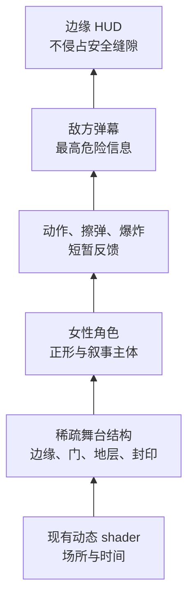
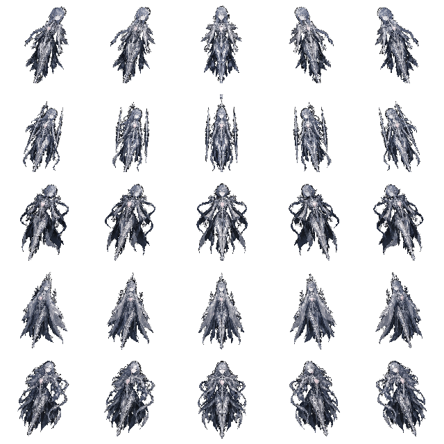
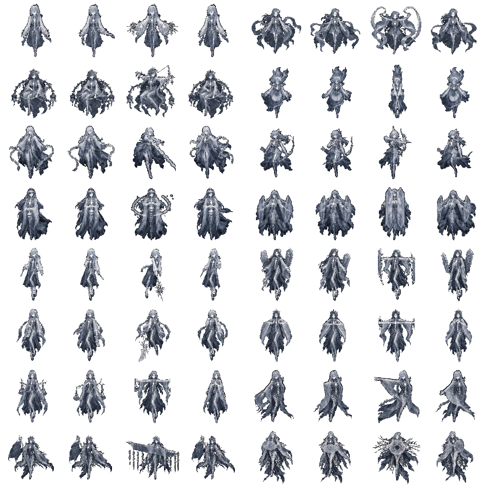
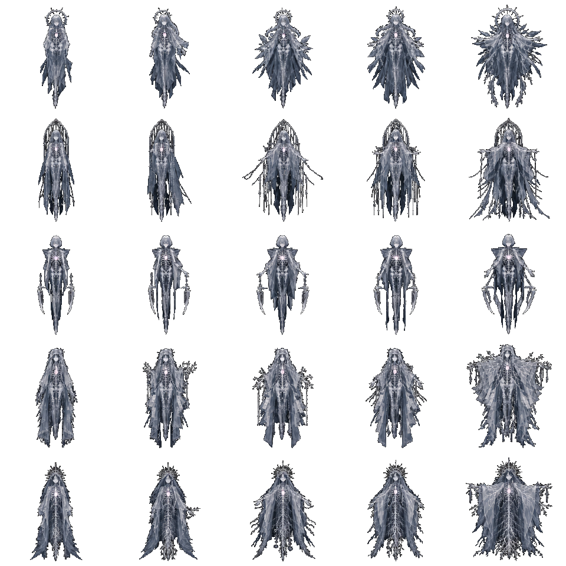
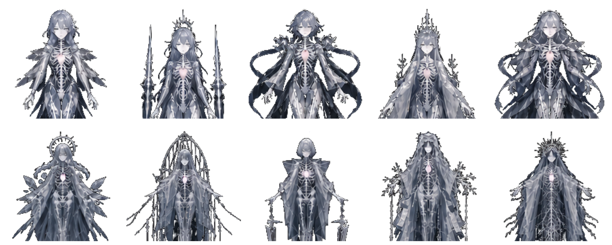

# v4 美术设计总纲：余白御寮

> 状态：**v4 实施起点 / 视觉与技术共同约束**
>
> 日期：2026-07-22
> 适用范围：五位可选主角、16 类敌人、5 位 Boss、四关舞台、项目自有 `packs/v4` 弹幕/特效/UI，以及已购买 BulletPack 的本地兼容参考
>
> 配套听觉规范：[`v4-audio-direction.md`](./v4-audio-direction.md)；Ghost 四层、余白、做减法与入神/出神在声音中的约束以该文为准。

v4 不继承旧 v3 的符号系统。它从一个更直接的日式 STG 命题出发：**玩家真正操纵的不是火力，而是弹幕之间的余白。人物以动作切开、收拢、诱导并占据这片余白。**

这里的“阴性”不是把女性等同于被动或空缺，而是一种主动的空间能力：容纳、回避、牵引、蓄势、让危险从身体两侧通过。主角、敌人和 Boss 因此必须都是画面中的实际人物；弹幕是她们对空间施加的语法，背景则是低声运行的场。


上图是 v4 的人物材质与轮廓锁定图：左为主角、中为杂兵、右为 Boss。它由项目所有者提供的 2023 年 `Data-Highlighter / Ghost` 旧作参考重新抽象而来，不复制旧角色的脸、花饰、辫发或坐姿。最终角色统一继承其冷灰蓝、半透明身体、骨相、菌丝与心脏层；早期彩色人物稿只保留为动作构图记录，不再具有色彩、服装或材质决定权。

---

## 0. 旧作 DNA 与 v4 人物风格锁定

旧作参考给出的不是一套“滤镜”，而是可动画、可切换的身体结构：

| 层 | 视觉职责 | 稳态 | 施法 / 受击 / 消隐 |
|---|---|---|---|
| 外表 `surface` | 人物身份、脸、服装与主要剪影 | 冷灰蓝、60–88% 不透明；大块明暗优先 | 由局部蒙版缺失，不做整人淡出 |
| 骨相 `skeleton` | 身体内部秩序、死亡与持续存在 | 只在胸腔、手臂或腿部小面积透出 | 可扩大到 35–70%，与外表产生 1–3px 离散错位 |
| 菌丝 `mycelium` | 互联网缝隙中的连接与扩散 | 极细白线，肩、手、袖缘少量露出 | 沿动作方向生长/摆动，Boss 可越出人体轮廓 |
| 心脏 `heart` | 唯一温度、节奏与危险阶段提示 | 1–3px 冷白偏粉小核 | 固定 tick 脉动；不可高频闪烁或代替命中判定点 |

三层不是“越多越完整”，而是互相遮蔽、暴露和错位。负空间发生在外表被拿走的部位：玩家看见的空缺同时露出骨与菌丝，人物仍然存在，却不再由一个封闭皮肤定义。

### 0.1 必须继承的形式语言

- 近黑底、冷银灰和低饱和蓝；白色轮廓光只沿局部结构出现。
- 成人女性的完整身体与克制表情；不做 chibi、校园制服或彩色奇幻铠甲。
- 半透明衣料使用大面积灰阶，不依赖细碎花纹；缩到 42–100px 后仍先读到头、胸腔、双臂/袖和主要道具。
- glitch 来自三层的蒙版替换、位置错位和短暂缺帧，不使用连续 RGB 分色、全屏扫描线或噪点墙。
- 菌丝放在人物上层才可读；肩部与袖缘允许极小幅漂动，Boss 的菌丝可以穿出人体形成更大的负形。
- 心脏脉动是低频动作；骨相不能以血肉恐怖或写实伤口呈现。

### 0.2 在 STG 尺寸下的简化

- 42–48px 杂兵：骨相只保留胸腔弧、前臂/小腿两组白节；菌丝最多 3–5 条；心脏为 1px 核。
- 52–60px 精英：可露出半侧胸腔和一组肩部菌丝；攻击帧才增加内部层面积。
- 80–112px Boss：三层完整表达；phase 开始用层切换作为施法标点，但敌弹仍覆盖人物。
- 48–56px 主角：脸与外轮廓优先，胸口心核不能与 2.5px 玩家判定点混淆；focus 判定点仍是独立 UI 层。

### 0.3 动画与确定性

人物层切换只能读取已经存在的固定 tick、输入、实体 age、受击与 Boss phase；不调用墙钟、不采随机数，也不反向触发发弹。推荐离散状态为：

`surface → surface+skeleton → skeleton+mycelium → surface`

状态间可使用 1–3px 的整像素位移和 2–4 tick 的局部蒙版切换。不能用亚像素抖动；同一 replay 在同一 tick 必须得到同一层、同一偏移和同一帧。

---

## 1. 核心体验

### 1.1 视觉注意力的固定顺序

任何一帧都必须按以下顺序被读到：

1. 敌弹的实心弹芯与运动方向；
2. 玩家判定点和最近的安全缝隙；
3. 主角、敌人、Boss 的轮廓与动作；
4. 掉落、爆炸和擦弹痕迹；
5. HUD；
6. 舞台结构；
7. 背景 shader 的氛围。

这不是“背景越黑越好”。shader 可以丰富，但它必须是低频、连续、不可被误认成弹体的运动。角色可以细致，但危险信息仍要覆盖角色。



### 1.2 正形与负形

- **正形**：人物身体、衣袖、头发、手势、武器与使魔。
- **负形**：袖口之间、发丝与躯干之间、角色两侧、弹幕波前之间的暗区。
- **行为痕迹**：玩家实际飞过的路径、擦弹留下的短痕、Boss 手势闭合后出现的弹幕孔洞。

角色的剪影要“开合”。待机时袖与发形成可呼吸的黑色缺口；施法时缺口收束并把视觉方向推向弹幕的出射轴。负空间因此由角色行为生成，而不是贴在背景上的空洞图标。

### 1.3 日式 STG 的四条美术原则

- **躲避先于瞄准**：弹幕的空隙必须比敌人的装饰更易读。
- **确定性先于随机炫技**：动画只读固定 tick、实体 age 和玩法状态。
- **危险与诱惑同色分层**：弹芯最亮；擦弹痕迹用短暂洋红/白；背景不得伪造可收集物或弹点。
- **密集产生安静**：越接近高密度 Boss 阶段，舞台层越应退后，人物只保留轮廓、脸和施法手势。

---

## 2. 世界与人物：余白御寮

“御寮”不是一个写实机构，而是四个逐层收紧的空间制度。每一关都把玩家的可移动余白重新定义一次：

| 关卡 | 现有 shader | 空间命题 | 女性角色的动作语法 | 主色限制 |
|---|---|---|---|---|
| 1 旷野 | `expanse` | 余白仍然开放，可以横向试探 | 袖、披帛和月轮向外打开 | 银、深青、少量月白 |
| 2 竖井 | `undertow` | 空间被迫向下/向内选择 | 长发、符带和长枪建立纵轴 | 墨黑、靛青、低饱和青 |
| 3 沉积 | `stratum` | 路径被记录、盖章并层层堆叠 | 卷轴、碑片、扇面把余白分栏 | 冷黑、灰褐、受控琥珀 |
| 4 穹顶 | `vault` | 选择被封闭成最后的狭缝 | 冠、宽袖与环形法具逐步合拢 | 黑漆、紫、绯红、冷灰 |

所有现有 stage 与 Boss shader 的场景身份均保留，包括 `signet`、`umbra`、`cordon`、`intaglio`、`sable`、`decree`、`regnum`。v4 不以静态全屏图替换它们；允许经逐场可读性审查后做受控调频，也允许 shader 在单 pass 中采样项目自有的低频绘制母版。本轮 `signet` 的玩家活动带已降低高频法线、反光与细波纹，新的精确 hash 已重新锁定。
当前审查不限于 `signet`：14 场的生产状态逐项记录在 8.2，其中
`expanse` 的动态基底保持 git HEAD 原始实现，并与新的冷青 Ghost
有限调色板像素膜层组合。

---

## 3. 五位可选主角

五位角色共享同一个 2.5px 致死判定逻辑，但外形、速度、擦弹半径和武器体验不同。人物本体是主角；pack 的 ship 只作为背负式翼装、集中射击核心或 Bomb 变身部件，不能单独冒充人物。默认 `packs/v4` 使用项目自有的五档心翼核心；只有显式选择 `?pack=bulletpack` 时才会换入购买素材的同语义兼容层。


从上到下依次为 SCOUT、LANCE、HOUND、SPIRE、MAW。每行从左到右是 hard-left、left、idle、right、hard-right。运行时使用统一 union crop 和中心 pivot，不逐帧裁边；所有角色在同一冷灰蓝体系内，以发型、外层轮廓、使魔/法具和菌丝生长方向区分，而不是换色。

| 角色 | 原玩法 | 人物设定 | 轮廓 | 视觉重点 |
|---|---|---|---|---|
| SCOUT | 松散广角 / 聚焦收束线 / 转分潮 Bomb | 月白巡行巫女 | 短衣、长青色披帛，横向开放 | 冰青弹扇聚成白蓝中缝，初学者一眼读懂状态切换 |
| LANCE | 平行骨针 / 聚焦切痕 / 贯刺 Bomb | 持骨刃的判词巫女 | 纵长法衣与一条中央骨轴 | 聚焦后骨白节段合为窄切线，Bomb 是向上的贯穿动作 |
| HOUND | 松散追踪 / 聚焦锁定 / 群使 Bomb | 带双使魔的寻迹者 | 左右各一只近身灵犬，外轮廓不对称 | 使魔、追踪鳞与三体环绕形成清楚的“群”身份 |
| SPIRE | 脉冲激光 / 持续灼边 / 定植场 Bomb | 以光柱定界的塔祭司 | 高发饰、长袖夹住中央权杖 | 聚焦时轮廓从宽变窄，relay 排列夹住持续光柱 |
| MAW | 松散近身散射 / 聚焦心核团 / 吞噬 Bomb | 以双月袖近身咬合余白的仪式者 | 黑漆短衣、两片新月袖、中心暗孔 | 收束弹团与内卷 Bomb 都向中心咬合，贴弹时判定点仍清楚 |

### 3.1 主角动画

第一批运行时动作：

- `bank-hard-left`
- `bank-left`
- `idle`
- `bank-right`
- `bank-hard-right`
- `focus-idle`（第二批，可由 idle 加判定点层先落地）
- `bomb-cast`（第二批）
- `death`（当前使用项目自有 v4 `boom.player`；后续补人物轮廓消隐 4–6 帧，显式 BulletPack 兼容模式只替换同名特效像素）

五档倾斜是姿态，不是 60Hz 闪烁动画。输入刚改变时经过 gentle 帧，持续按住后进入 hard 帧；当前实现松开即回 neutral，若以后增加收回过渡，也必须由 replay 输入与固定 tick 推导。

运行显示盒：SCOUT/LANCE 为 `52×52`，HOUND/SPIRE/MAW 为 `54×54`；源帧统一 `128×128`，人物保持纵向比例居中在透明方格内，四周至少 8px 全透明。聚焦判定点是独立层，不能烘焙在人物每一帧里。

---

## 4. 敌人：16 位女性，不使用抽象占位符

杂兵不是缩小的 Boss，也不是相同身体换颜色。每一类至少有自己的头身比例、袖型/武器和运动方向。小尺寸仍要先读到女性轮廓，其次才读到职业物件。


每张表按关卡实际角色逐行排列；每行四帧依次是 idle A、idle B、attack、recover。第四关复用的 `grunt`、`lash`、`assessor` 保留她们前关的轮廓与本色，表达旧机构被终局征用，不伪造新的敌人类别。

| 关卡 | 运行名 | 角色原型 | 动画/动作重点 | 显示盒 |
|---|---|---|---|---:|
| 1 | `grunt` | 月野侍从 | 双袖随直线下降轻摆 | 42×42 |
| 1 | `weaver` | 织隙女 | 两条披帛交替开合，暗示蛇形移动 | 48×48 |
| 1 | `turret` | 定座弓巫 | 悬停、举弓/法轮、回落 | 54×54 |
| 2 | `drifter` | 坠流侍女 | 长发向上漂，身体下沉 | 44×44 |
| 2 | `lash` | 符鞭使 | 细长鞭/符带建立射线方向 | 48×48 |
| 2 | `hunter` | 追迹弓手 | 侧身搜寻、锁定后正对玩家 | 48×48 |
| 2 | `censer` | 持香炉者 | 双手合拢后放出环形火弹 | 54×54 |
| 2 | `bastion` | 盾衣守门人 | 宽袖/盾片闭合，形成重型轮廓 | 58×58 |
| 3 | `clerk` | 执笔小吏 | 笔尖点出自机狙，动作短促 | 47×47 |
| 3 | `stele` | 背碑女 | 身后大碑片左右错位，形成弹墙预告 | 54×54 |
| 3 | `summons` | 传唤使 | 抛出长符，符尾指向追踪弹 | 46×46 |
| 3 | `ray` | 裁光者 | 双臂/袖口拉出激光轴 | 52×52 |
| 3 | `assessor` | 衡量官 | 小秤或双盘围绕身体旋转 | 52×52 |
| 4 | `usher` | 引路者 | 侧身手势把玩家导向狭缝 | 46×46 |
| 4 | `marshal` | 阵列统领 | 宽肩、旗/尺，将弹墙排成队列 | 58×58 |
| 4 | `notary` | 盖印者 | 印面朝屏幕展开，环弹由中心出现 | 54×54 |

每位敌人提供 4 帧：`idle-a / idle-b / attack / recover`。运行时不把四帧无条件循环：无攻击状态只在 idle 两帧之间缓慢呼吸；只有子弹真正进入 BulletSystem 后才记录发弹 tick，并依次映射到 attack/recover。弹池拒绝的发射不冒充攻击，动画也不反向影响发弹。

---

## 5. 五位 Boss

Boss 的人物身份必须先于几何弹幕身份。五位 Boss 的服装从开放到封闭，体现四关余白逐步被制度化。


从上到下为 Sentinel、Warden、Magistrate、Chancellor、Regent；从左到右是稳定、预备、施法、扩张与收束姿态。骨相和心核提供共同身体语法，月轮、笼形结构、双刃、档案菌丝和根系冠冕提供五位 Boss 的身份差异。

原始联系图不是规则网格；按五等分直接裁切会让切线穿过披风、手臂和根须。运行图集改由隔离母版
`art/v4/boss-cast-ghoststyle-atlas-master.png` 编译：先把所有非黑前景连通域归属到 25 个语义姿态，再以每位 Boss
统一尺度装入 `192×192` 帧并保留 8px 透明边。`tools/v4-actor-assets.ts`
保证每个已归属的源前景像素都会进入缩小后的像素桶，不再依赖等宽/等高矩形猜测。

| Boss | 角色设定 | 负空间结构 | 关键帧 | 显示盒 |
|---|---|---|---|---:|
| `sentinel` | 月下守望者 | 月轮、袖与身体之间有三个开口 | idle / prepare / cast / expand / close | 88×88 |
| `warden` | 竖井守门者 | 垂直符带夹出中央窄缝 | idle / prepare / cast / expand / close | 88×88 |
| `magistrate` | 判词术师 | 扇或印将左右空间划成裁决区 | idle / prepare / cast / expand / close | 95×95 |
| `chancellor` | 档案宰辅 | 卷轴和浮碑层叠，但脸与双手保持空 | idle / prepare / cast / expand / close | 96×96 |
| `regent` | 穹顶摄政者 | 冠环与宽袖逐帧闭合成最后狭缝 | idle / prepare / cast / expand / close | 110×110 |

Boss 稳态不应把五帧当普通循环。最少需要三类展示状态：

- `idle`：非符卡或移动；
- `cast`：新 phase 开始、施法或主要 pattern 出现；
- `hit`：局部接触反馈；重击短暂选择 `close` 姿态并产生纯视图后坐；

当前运行时按语义选择五姿态：phase 开场短暂 `prepare`；子弹真正进入 BulletSystem 后进入 `cast`，随后短暂 `expand`；当前 phase 的剩余血量或时间进入最后八分之一时使用 `close`；其余为 `idle`。普通命中只在接触点限频显示，连续激光仍逐 tick 结算伤害；伤害不低于 2、散射和 Bomb 的重击可短暂后坐，但不修改 Boss 坐标、向量、半径或碰撞。最后三分之一血量逐步收缩身体，并按材质以固定 tick 显示膜状环裂、断骨节段、断裂回缩菌丝或低频双搏心核；四类使用冷灰蓝、骨白与低饱和粉白 Ghost 身体色，不借用高饱和弹幕色。所有选择只读固定 tick 的模拟事实，绝不通过动画回调发射子弹。

非最终符卡且存在本难度后继卡时使用独立 `boss.break`；timeout 也是有效 Break。最终死亡保留四层 Boss boom，并在渲染侧按五位 v4 Boss 映射月轮、符笼、双刃、档案菌丝与根冠五种身份消隐；第三方 Boss 只走通用死亡回退。

---

## 6. 从 BulletPack 功能参考到 v4 原创弹幕

BulletPack 是已购买的第三方素材，作者为 J i m（itch.io: `jinvorionstg`）。
它继续作为动画节奏、类别覆盖、运行时接线和兼容性对照，不再决定 v4 的
造型身份。最终默认包 `packs/v4` 使用项目自有像素：保留丰富颜色和现有
sim 几何，却把机战式弹体重绘成人物施术产生的外表、骨相、菌丝与心核。
需要复核时可从购买者副本临时生成 `bulletpack` 并通过
`?pack=bulletpack` 单独审计；生成包不在项目中保留，也不进入可提交的 v4
像素。


上图是形态与色彩母版，不直接缩放成运行素材。每个运行帧都要重新落在
第 6.3 节的引擎尺寸、透明边与碰撞可读性规则内。

| 分类 | v4 用途 | 合成/混合 |
|---|---|---|
| bullets | 四关敌弹与主角弹，按家族保留原生多帧色彩 | baked 或 floor tint；敌方 additive 标志必须生效 |
| lasers | 激光 body/cap | additive；body 纵向拼接不得出现透明断缝 |
| missiles | 重型威胁和 Boss pattern | normal，保持实体感 |
| explosions | 敌人、精英、Boss、玩家死亡 | 背板 normal，亮核 additive |
| pickups | 金币、宝石、金条 | normal；动画帧必须实际推进 |
| player option/thruster | 主角的翼装能量、使魔核心或集中射击反馈 | 人物下层 additive，option 可 normal |
| player bomb | Bomb 的弹体、场域与终结爆炸 | 按真实生命周期移动，不能静止放大贴图 |

### 6.1 完整性口径

- BulletPack 审计已完成：121 个 PNG 中 4 个是可证明的重复/系统垃圾，其余 117/117 均已在生成 manifest 中绑定到唯一、可追溯的消费者。
- “写进 atlas”不等于“实际上屏”。`kunai` floor、结算金币的所有帧、Bomb 的完整生命周期都要有运行时路径。
- 同一个源文件可服务多个语义名，但文档和清单必须标出复用，不能把别名数量冒充独立素材数量。
- 本仓库不提交购买包的原始文件；只在本机从购买者副本生成可运行 pack，避免再分发原素材。
- 默认 `packs/v4` 不读取 BulletPack，也不含购买像素；它由纯 TypeScript 生成器输出并作为可提交、可发布的项目自有美术包。

### 6.2 人物—弹幕关联

角色/派系决定色彩，运动语义决定身体层：

| 语义层 | 弹幕形态 | 运动语义 |
|---|---|---|
| `surface` | 中空圆弹、花瓣、封印环、半透明膜 | 固定阵列、环形、扩张与空间分栏 |
| `skeleton` | 骨白针、刃、直线光柱、关节状刻度 | 高速直线、狙击、切线与边界 |
| `mycelium` | 分枝丝、寻迹种子、波动尾、stream | 追踪、waver、spiral、sweep |
| `heart` | 高饱和心核、强弹、导弹、爆炸亮核 | 主炮、加速、爆发与终结 |

五位主角分别使用：SCOUT 冰青/群青/银白，LANCE 樱红/琥珀/骨白，
HOUND 翡翠/黄绿/金橙，SPIRE 紫罗兰/电青/银白，MAW 朱橙/桃红/酸绿。
同样的身份色只小面积进入人物心核、肩部菌丝、法具边缘、HUD crest 与她
发出的弹幕。杂兵与 Boss 按四关推进为银青、靛绿、琥珀玫红、帝紫绯红；
第四关征用的旧角色仍保留原身份色，不随场景强制换紫。

### 6.3 STG 实际尺寸

下表全部是 `480×640` 逻辑战场在 ×1 显示时的像素。尺寸以**可见内容**计，
不以带透明边的 atlas cell 计；导入器记录的 `contentW/contentH` 才是判断
画面体量的依据，透明 frame 只负责采样安全和跨帧稳定。

| 类别 | 可见内容建议 | 典型透明帧 | 视觉目标 |
|---|---:|---:|---|
| 微型点弹/擦弹火花 | 6–8px | 12–14px | 一个亮核与一个方向特征 |
| 小型圆弹/种子 | 8–12px | 14–18px | 中心空洞或心核必须仍可辨 |
| 中型环/花瓣/刃 | 14–20px | 20–28px | 至少两层结构，不能像背景碎片 |
| 大型法印/强弹 | 22–28px | 28–36px | 轮廓复杂但安全缝仍先读到 |
| 方向针/骨刃 | 长 18–36px、厚 5–11px | 每轴外扩 2–4px | +x 源朝向，尖端不可被透明边缩小 |
| 激光 body | 厚 12–30px | 长轴无空边、短轴 2–3px | tile 无断缝；可见厚度等于 skin 目标 |
| 导弹/寻迹心核 | 长 18–34px、厚 9–18px | 每轴 2–3px | 保持实体感，但不得冒充人物 |
| 普通/精英/Boss 爆炸 | 32–56 / 64–96 / 112–180px | 径向安全边 3–6px | 多层短时爆发，不长期遮住负空间 |

令人印象深刻来自弹芯亮度、几何秩序、角色/关卡身份和展开节奏，不来自
无脑放大普通弹体。大尺寸只留给确有阶段语义的法印、导弹、Boss 强弹与
终结爆炸；显示尺寸不会改变碰撞半径，同一弹在 Normal 与 Lunatic 上保持
同一视觉尺寸。这样密度上升时震撼来自“秩序逼近”，安全负空间仍然可读。

### 6.4 弹幕生成也是 v4 设计

弹幕的像素与弹幕的空间语法必须属于同一版设计，但两者不是同一种文件：

```text
src/v4/content/campaign.json
  → src/v4/gameplay/patterns.ts
    → src/v4/gameplay/behaviours.ts
      → 通用 BulletSystem / motion engine
        → packs/v4 的原创弹体像素
```

- `campaign.json` 决定四关何时、从哪里、用什么参数发射；
- `patterns.ts` 提供 `ring`、`spiral`、`aimed-fan`、`spray`、
  `alternating-fan`、`gap-ring`、`weave`、`lane-wall` 八个确定性几何词；
- `behaviours.ts` 提供 `homing`、`waver`、`accelerate-to`、`orbit`、`beam-sweep` 五个运动词；
- 通用 registry、Emitter、运动积分和碰撞仍在 `src/content/pattern-registry.ts` 与 `src/sim/`，不被某一版美术占有；
- `packs/v4` 只给上述语法提供可见身体。任意下载 pack 可以按名字组合已注册词汇，但不能注入 TypeScript、GLSL 或新的模拟规则。

所有生成逻辑继续遵守固定 60Hz tick、seeded sim RNG 和精确三角函数。动画
不能反向触发发弹，shader 也不能影响弹道。以后真正修改 pattern 或 behaviour
算法时，要把它当成 replay 版本变更，而不是“只改美术”。当前 replay 的
`content` 指纹已经覆盖 campaign JSON 与 `patterns.ts`/`behaviours.ts` 的精确
源码字节；数据或算法任一变化都会得到不同身份。四关 Normal/Lunatic golden
replay 则继续证明这次有意变更之后的逐 tick 行为。

---

## 7. 色彩与亮度预算

### 7.1 层级

| 对象 | 亮度约束 | 说明 |
|---|---|---|
| shader 场景 | 逐场标定，不设统一暗值 | 生产 `×1` 必须先看得见；以最终帧、相邻 tick 差分和真实弹幕覆盖共同验收 |
| 稀疏舞台结构 | 0.045–0.18 alpha | 至少 65% 像素完全透明，使用近黑身份色 |
| 角色墨线 | ≤0.05 | 与 shader 分离的暗外轮廓 |
| 角色内侧 rim | ≥0.55 | 让轮廓跨四种背景仍成立 |
| 角色稳态亮部 | <0.90 | 不触发主要 bloom |
| Boss 局部命中/心核 | 0.95–1.0 | 仅接触点或低频脉搏短暂越过阈值 |
| 敌弹/主角弹芯 | 1.0 | 永远是最高危险信息 |

背景不再服从跨场统一的 `0.05–0.10` 平均值或“整体压暗”目标。各 shader
内部的 tonemap、颜色空间和合成尾部不同，源码里的 `EXPOSURE` 常量不能横向
比较；验收对象是总览页生产 `×1` 的最终像素、相邻固定 tick 的变化，以及
真实游戏中人物、弹幕和 HUD 是否仍然赢得对比。低频暗场可以保留黑位，但不能
靠诊断倍率才显形；高亮场也不能把独立小亮点或玩家活动带推成伪弹体。

### 7.2 主色

- Void black：`#030509`
- Ink navy：`#070A12`
- Bone shadow：`#596574`
- Ghost blue-gray：`#8797A8`
- Surface silver：`#B9C4CF`
- Bone white：`#E9F0F4`
- Cold rim：`#DDF4FF`
- Heart core：`#F0D8E2`
- Graze magenta：`#E64F9C`

人物本体以灰阶和冷蓝灰为主，单关强调色只允许进入发饰、道具或衣料边缘，面积不超过人物非透明像素的 8%。心脏只保留极低饱和粉白，不做红色血肉核。v4 原创弹幕的高饱和色属于危险层；这让人物的“无色身体”和弹幕的“有色施术”形成清晰分工。

---

## 8. 背景 shader、绘制母版与稀疏舞台层

现有 shader 是 v4 的动态底层：不删除、不烘焙、不被静态图替代，也不通过 UI
铺设不透明全屏覆盖层。03–06 四个正式关卡各有一张项目自有绘制母版，由本场
shader 分级并在逻辑像素网格上单 pass 合成；菜单、Boss 站、出神与结算场景
保持 shader-only。14 个 authored scene 归档在 `src/v4/backgrounds/`；
通用 registry、全屏 quad、uniform 与 60 tick 转场引擎仍在
`src/render/background.ts`。每一场当前的 fragment SHA-256 与
`scrollSpeed` 都由测试锁定。2026-07-24 对 14 场完成逐场生产审查：这不是
把所有背景统一重画，其中 `expanse` 明确恢复并保留 git HEAD 的原始
`lens-whisper` 作为动态基底；其余场景也以各自原算法和运动身份为起点，只在当前源码明确
记录的色彩、空间频率、玩家活动带、速度或可见度上调整。当前结论见 8.2。

四关结构由 `V4StageStructure` 的单个透明 shader mesh 提供，不增加另一张大
atlas：旷野是开放门与月轮，竖井是长墙与封印，沉积是大块档案板，穹顶是
穹壳、眼孔与两翼。它只在 `expanse/undertow/stratum/vault` 出现，Boss 与菜单
场景映射为空，并与背景读取同一个 scene、同一个固定 tick 与同一个 60 tick
转场。

推荐 renderOrder：

| renderOrder | 内容 |
|---:|---|
| 0–1 | 当前与转场中的背景 shader |
| 100 | 四关稀疏结构 mesh，alpha 0.045–0.18 |
| 199 | 敌人/Boss 局部暗垫 |
| 200–202 | 敌人/Boss 人物 |
| 398 | 主角局部暗垫 |
| 399 | 主角 thruster/背后效果 |
| 400–402 | 心翼/主角人物 |
| 600+ | 敌方弹幕和更高危险层 |

舞台图层的硬规则：

- 每帧至少 65% 完全透明；禁止全屏半透明第二背景。
- 新层对全屏 mean luminance 的增加不超过 0.015。
- 禁止 6–28px 的独立亮点、花瓣、星点和短线；它们会伪装成弹体。
- 独立高亮结构最小尺度约 48px。
- `y ≥ 420` 的玩家活动区尽量不增加超过 0.02 的亮度。
- 结构移动只读整数 tick；当前最快三阶位移也低于 0.1 逻辑像素/tick，不读墙钟。
- Boss shader 切换时，舞台层必须参与同一个 60 tick 转场，不能把旧关卡装饰留在新场景上。

### 8.1 四关具体限制

- 旷野：只加左右框架或纵向远景；不得再加横向亮带。
- 竖井：舞台物件用墨黑、靛青和灰紫；不再增加洋红/橙/青碎片。
- 沉积：禁止网纹、细斜线和点阵；只用大块纸门、岩层或档案剪影。
- 穹顶：背景避免金色与肤色；使用黑漆、深红、冷灰，near 层可以为空。

### 8.2 2026-07-24 shader 审查与生产基线

本轮保持 registry 名、campaign 引用与固定 tick 时钟，并逐场从原始算法重新
判断哪些内容应保留、降频、调色或提亮；它不意味着 14 场都经过 v4 造型重绘。
特别是 `expanse` 的 shader 已回到 git HEAD 原始 `lens-whisper`，现在由原创
绘制层补充远场空间；不再把 shader 本身描述成柱体、开放通道或新造的雾场。
下表记录当前代码与总览页元数据共同声明的生产身份：

| 叙事组 | scene | 当前生产实现 |
|---|---|---|
| Shell | `drift` | 月轮、冷银水面与上部标题负空间；减少水纹层数和碎反光 |
| Shell | `signal-decay` | Ghost 宽带由清晰走向解体；移除 bit-crush、RGB 边与噪点墙 |
| Four stages | `expanse` | 原创 Ghost 冷青膜层母版建立连接边缘与中央远空；固定调色板运行图和原始 `lens-whisper` 的六个 Lissajous 光源、横向 anamorphic 拖影、宽化 bokeh 与低亮 FBM 一并锁到 480×640 逻辑像素，时钟与速度不变 |
| Four stages | `undertow` | 原创靛青 Ghost 竖向膜层母版建立下沉深度与中央通道；静态运行图和原 `tropical-heat` simplex domain warp、冷折射一并锁到 480×640 逻辑像素，RGB 分离、彩色碎片和爆闪退场，时钟与速度不变 |
| Four stages | `stratum` | 原三中心 gradient 与 travelling wave 始终是完整发光主体，内部时钟加快 15%；原创 soot/slate Ghost 母版不再作为不透明颜色层，只转换成低频明暗浮雕与微量近等亮度色相，对下方动态 shader 做调制；完整 hybrid 锁到 480×640 逻辑像素网格，且不使用 Bayer、halftone、cross-hatch、纸板或印章图形 |
| Four stages | `vault` | 原创黑紫 Ghost 膜层母版提供侧向压力体量与石墨支撑带；绘制层保持 grid-locked，原 `fluid-amber` 双重 domain warp 在同一 480×640 逻辑像素网格上驱动压力光，总速度为原版 `110%` |
| Five stations | `signet` | 月银液体印记；继续压低玩家活动带 normal/specular/ripple |
| Five stations | `cordon` | 原 `hologram-glitch` 的有机 rotated-FBM 体积与平滑横向错位保留；RGB 分色、扫描线、grain、亮 sweep 与噪块收束为连续靛青 Ghost 膜 |
| Five stations | `intaglio` | 原 `bass-ripple` 鼓膜波推动柔性骨银蜂巢与三向棚拍反光；网格退为材质，行进形变和宽高光成为主体 |
| Five stations | `sable` | 冷黑玻璃中的大型封存气泡保留宽软膜边与上升；生产 `×1` 可见，不重新加入亮点、细 rim 或爆泡 |
| Five stations | `regnum` | 原 `topographic` 的四 octave 地形与十四层解析等高线完整展开；不插入空席、中央裂缝、脸或对称徽记，紫、绯与冷银随高程自然闭合 |
| Trance | `umbra` | `Total Eclipse` 保留无独立星点的冷紫帷幕、漂移与遮蔽；生产 `×1` 提亮后仍不生成孤立亮点 |
| Trance | `decree` | 四个原始环源继续生成 moiré；暖灰、受控琥珀与骨色由宽拍频主导，细四向乘积只作为低增益材质 |
| Stage 2 transition | `surge` | Magistrate 的全难度开场 `Arraignment`：原 `ink-dissolve` 的内部双重 domain warp、漂移墨源与反应边把 `undertow` 的开放竖井收束成墨膜，再进入 `intaglio` 的裁决印记；不插入硬板或几何裂缝，总速度为原版 `110%` |

`test/visual/scenes-compare.html` 同步改成 v4 场景总览：默认显示 production
`hybrid ×1` 与真实 `V4StageStructure` 合成，`art / shader / hybrid` source
与 `scene only / composite` 结构开关相互独立，03–06 四关标记绘制层。页面按 Shell、
四关与对应守印站、Trance、Utility 的叙事顺序排列；每张卡另列“主线
N/4、关卡位置与对应 Boss”，避免把 shader 资源编号误读成关卡号。时间由固定 60Hz
accumulator 推进，单帧差分严格比较相邻 tick，fade lab 默认使用游戏真实的
60 tick。`__measure` 固定读取 production source ×1（四关 hybrid，其余
shader）；`__dump`、`__strips` 保持 shader-only ×1 兼容语义，composite
导出固定为 production hybrid + structure。

总览的亮度数字用于逐场比较最终输出，不用于倒推出一条统一的 shader
`EXPOSURE` 阈值。生产 `×1` 必须能够直接辨认材质和运动；诊断倍率只用于排查，
不能成为场景可见的前提。

---

## 9. 图集与动画技术规格

### 9.1 当前图集与下一阶段资产

| 文件 | 内容 | 状态 / 色彩模式 |
|---|---|---|
| `packs/v4/actors/players.png` | 5 主角 × 5 banking 帧；三层烘焙合成 | pack v4 已声明并运行，baked / normal |
| `packs/v4/actors/enemies.png` | 16 敌人 × 4 帧；三层烘焙合成 | pack v4 已声明并运行，baked / normal |
| `packs/v4/actors/bosses.png` | 5 Boss × 5 帧；由隔离母版确定性编译 | pack v4 已声明并运行，baked / normal |
| `packs/v4/actors/portraits.png` | 5 主角 + 5 Boss 的 256px 对话近景；由两张原画母版确定性编译 | pack v4 已声明并运行，baked / normal；对话局部 high-quality 下采样 |
| `packs/v4/` 其他分类图集 | 原创 bullets/effects/lasers/missiles/pickups/ship/player effects | 已运行；baked，neutral floor 可 tinted |
| `src/assets/v4/ui-v4.png` | `1024×768`：原 32 个 procedural cell + 六类差异化组件，共 38 cells | 已运行，baked / normal；由 `1086×1448` RGB 绿幕 ornament 母版确定性生成 |
| `actor-skeleton-v4.png` | 独立骨相蒙版/亮层，与人物帧同 pivot | 下一阶段，baked / normal 或低强度 additive |
| `actor-mycelium-v4.png` | 菌丝、心脏与边缘光；不能含人物底色 | 下一阶段，baked / additive，低强度 |
| `src/v4/backgrounds/structure.ts` | 四关稀疏透明舞台结构 | 已运行，tick-driven / normal；当前无需独立 `stage-props-v4.png` |

角色使用独立 actor atlas/batch；不要把大人物与 8192 发敌弹重新绑进同一纹理。BulletPack 与原创 v4 包都保持 bullets/lasers/missiles/effects/pickups 分类 atlas。这样人物采样、容量与混合策略不会受弹幕热路径牵制。

第一阶段可将 `surface+skeleton+mycelium` 烘焙在每个动作帧中，先保证所有人物上屏且风格一致。第二阶段再拆成同尺寸、同 pivot 的独立层，获得旧作式 glitch 排列组合。无论哪一阶段，源 PSD/Krita 文件都必须保留三层，不允许只交一张扁平 PNG。

当前第一阶段实际运行图集如下。灰蓝底是透明像素查看器的棋盘替代色，不会进入游戏画面：









### 9.2 帧规则

- horizontal strip，frame 0 在最左；
- 主角与敌人运行帧为 `128×128`，Boss 为 `192×192`；对话近景为
  `256×256` 单帧，并从母版近景而非运行小图生成；
- 场上 actor 最近邻采样、无 mipmap；对话近景只在 Canvas2D 合成时 high-quality
  缩小，不能把整个 pack 的战斗纹理改成 linear；
- `texture.flipY=false`，沿用现有 y-down UV，不做第二次 y 翻转；
- baked 色彩，`NoColorSpace`，不要额外标 sRGB；
- 每帧四周至少 4px 全透明；
- 角色脚底/pivot 跨帧偏差 ≤1px；
- 敌人 idle 6–10 tick/帧；Boss idle 8–12 tick/帧；cast 3–5 tick/帧；
- 同一动作的亮度重心不得跳动超过 5%；
- 显示尺寸不改变模拟 hitbox。

### 9.3 人物局部暗垫

在复杂 shader 上，不用给人物加白色外发光。人物下方放一块仅比轮廓外扩 12–20px 的近黑 normal-blend 暗垫：

- 小敌人 alpha 0.16–0.22；
- 精英 alpha 0.20–0.25；
- Boss alpha 0.25–0.35；
- 主角 alpha 0.18–0.25。

暗垫已由一张可复用的 `64×64` 径向 cell 实现：敌人 `0.20`、Boss `0.30`、
主角 `0.22`，只随人物移动。它不得连接成全屏 vignette；敌弹仍画在它与人物
上方。

---

## 10. UI 与擦弹

HUD 仍占四角和边缘，不进入画面中央安全缝隙。


该图锁定骨白细线、菌丝角饰、心核 crest、组件层级和负空间比例；它仍是
构图与风格参考，不直接作为运行图集。真正进入生产链的是从该方向生成并验收的
[`ui-production-ornaments-master.png`](art/v4/ui-production-ornaments-master.png)：
一张 `1086×1448` RGB 绿幕原画，包含 title masthead、menu row、character
frame、dialogue frame、status frame 与 Boss ornament 六类差异化组件。
[`ui-screen-perimeter-master.png`](art/v4/ui-screen-perimeter-master.png) 是已生成的
`1254×1254` 外框方案研究原画，仅作为设计过程存档，不进入生成器、atlas 或
runtime。实际 UI 按 480×640 战场重新排版；Title、Difficulty 与 Character
采用开放式构图，不使用封闭的完整 outer panel，让 shader 背景和透明负空间参与
层级，而不是再用一圈边框封住界面。

- 普通文字：月白/灰，低于人物脸部亮度；
- Graze：仅在数值增加后的短时间转为洋红；
- Boss 条：使用本关/Boss 的受控强调色，不能做大面积发光条；
- Focus：人物中心显示实际 `player.radius` 判定点（内置五人为 2.5px）及一圈缓慢呼吸的暗/亮双环；
- 擦弹痕迹：在最近弹体侧留下 4–10 tick、1–2px 宽的短弧，不能长驻。

玩家路径可以在极低 alpha 下短时留痕，但它必须由真实移动和 graze 写入，不能预画成装饰。它是 aaajiao“互联网负空间”在玩法中的对应：系统不替玩家画出正确路径，玩家的选择暂时改变空白的可见性。

### 10.1 engine-owned v4 UI 第一版（2026-07-22）

运行资源为 [`src/assets/v4/ui-v4.png`](../src/assets/v4/ui-v4.png)，由
[`tools/make-v4-ui.ts`](../tools/make-v4-ui.ts) 使用纯 TypeScript 与仓库 PNG
codec 确定性生成，不依赖 Canvas、字体、原生图像库或网络。生成器只读取上述
`1086×1448` RGB ornament 绿幕母版，从空白外边带采样 key colour，恢复带软边覆盖率的 straight alpha，
去除混色绿边，再以居中的 cover crop 在 premultiplied-alpha 空间做 area-filter
缩小；因此细白/粉色线条不会被透明绿或黑色压暗，也不会做非等比拉伸。
`src/render/v4-ui-layout.ts` 同时作为生成器和浏览器的尺寸真值，避免 atlas
裁切与 480×640 运行布局分别维护。

- atlas：`1024×768 RGBA`；`y=0..255` 保留原 32 个 procedural cell 的布局与像素，下面 512 行承载 6 个 production-derived ornament，共 38 cells；logo `320×72`、旧九宫格 tile `48×48`（角 `12px`）、cursor `24×24`、divider `320×12`；
- 五角色 crest 与四难度印均为 `48×48`；状态印为 `56×56`；HUD icon 为 `16×16`；
- Boss 框 `420×16`、血条 `360×8`、计时线 `360×4`；focus ring 与四帧 graze arc 均为 `32×32`；
- production ornament：title masthead `400×96`、menu row `300×50`、character frame `170×300`、dialogue frame `456×164`、status frame `300×436`、Boss ornament `440×72`；角色选择会裁掉 actor neutral frame 的公共透明边，再以精确 2× 放大放入紧凑 frame；
- Title、Difficulty 与 Character 不绘制完整外框或连续暗色 outer panel：标题、选项行、角色身份框和必要分隔各自建立层级，外围保持开放；旧 procedural `ui.panel.9slice` 只服务确有内容承托需求的局部小底板；
- Title 使用 masthead，所有菜单行使用独立 row 轮廓，Character 使用包住真实 actor 的身份框，Dialogue 使用圆形 portrait well 的专用框，Pause / Stage Clear / All Clear / Game Over / Ending 使用 status frame，Boss 条叠加独立 ornament；所有面板仍是局部构图而非全屏覆盖；
- 标题、菜单项、难度说明、角色文案、Boss/phase 名、对话与计数等文字仍由 runtime 动态绘制，不烘焙进母版或 atlas；第三方 pack label 与 Unicode 因而保持原字符串；
- production 隐藏 tick / bullet / draw-call 与 Bloom 控制，只有 `?debug=1` 显示并允许 `B` 切换；
- focus 内核直接读取 `player.radius`，外环只读 `run.tickCount`；graze arc 只响应已有 `graze` RunEvent；结算金币只读状态 `age` 选择原 strip 帧；
- 对话中的玩家名读取角色 registry label，五角色强调色分别锁定为 Scout `#8CEBFF`、Lance `#FF91BD`、Hound `#70DFA2`、Spire `#B58CFF`、Maw `#FF795C`；未知 pack speaker 与 Unicode 文本保留原字符串并走现有 portrait fallback。

专用 portrait atlas 位于 `packs/v4/actors/portraits.png`：运行时按十位角色的
稳定 strip 名读取 256px 近景，局部开启 high-quality 下采样后放入 112px 圆井。
生成器直接读取已保存并 hash 锁定的 player/Boss 原画母版，按语义 pose 分离前景、
恢复 straight alpha，再把脸、心核和手部构图放进带透明 gutter 的单元；它不从
128/192px 运行 actor 二次放大，也不另画一套人物身份。缺少该 family 的旧包继续按
逐人 anchor 裁 field actor；第三方角色继续使用 top-level pack portrait 或确定性
fallback。

---

## 11. 实施顺序

### 11.1 2026-07-22 实现基线

| 项目 | 当前状态 | 下一验收门 |
|---|---|---|
| shader / 舞台 | 14 个 authored scene 已完成逐场生产审查并归 `src/v4/backgrounds`；四个正式关卡各接入与人物同源的 Ghost 像素膜层，原 shader 继续负责全部动态；四张运行图由逐场固定调色板确定性编译为 480×640，完整 hybrid 锁到逻辑像素网格；其余场景保留各自 shader 身份；四关稀疏结构与背景共用固定 tick/60-tick 转场；总览默认显示 hybrid 生产合成 | 浏览器逐关确认结构不伪装弹体、Boss 转场无残留 |
| 弹幕生成 | `src/v4/gameplay` 已拥有 8 个 pattern 与 5 个 behaviour；16 类敌人各有唯一 `pattern+弹体` 签名，5 位 Boss 每阶段至少两层弹幕且每位使用至少四类几何；campaign 与可执行 gameplay 共同进入 replay 指纹 | 浏览器逐关确认迁移缺口、交织线与通道墙在 Normal/Lunatic 都保留连续安全缝 |
| 主角火力 | 五种 shot 的四个威力等级都具有独立的 loose/focus 弹种、阵型或节奏；五人各有唯一 option 阵型与 Bomb 规则，runtime 优先消费各自 option/Bomb strip | 浏览器逐人检查松开/聚焦切换、满火力可读性、Bomb 持续动画与实效范围一致 |
| 角色名绑定 | 5 主角 / 16 敌人 / 5 Boss 已换入本章 Ghost 三层烘焙图集，并有独立 actor atlas 与 base 名映射 | 浏览器逐关检查 ×1 尺寸轮廓、pivot 与弹幕覆盖关系 |
| 多帧 | 玩家 banking 已由默认 pack 的 `banking: five-way` 接通；敌人 attack/recover 与 Boss 五语义姿态读取真实成功发弹及 phase 事实 | 浏览器确认小尺寸动作有辨识度且不掩盖发弹 |
| 命中材质 | 16 类敌人和 5 位 Boss 全部显式绑定 `surface/skeleton/mycelium/heart`；四套 8 帧反馈同时有 procedural floor 与 v4 native strip；Boss 接触显示统一限频但伤害逐 tick，重击仅改变姿态/局部层；最后三分之一血量固定 tick 收缩、开裂与双搏 | 浏览器逐材质确认膜纹、骨节、菌丝回缩和心核压缩在实战尺寸仍能区分 |
| 对话头像 | 主角与五位 Boss 已从同一 Ghost 原画母版生成独立 256px 近景图集；旧包保留 field-actor crop，第三方 pack speaker 仍走其 portrait/fallback | 浏览器检查十张圆形裁切、脸、心核、黑边和姓名板在四种 shader 上均可读 |
| 三层 glitch | 外表/骨相/菌丝+心脏已烘焙进所有人物动作帧 | 再拆 `surface/skeleton/mycelium+heart` 同 pivot 图层，接旧作式排列组合 |
| 负空间反馈 | 人物透明孔洞、局部暗垫、读取实际 2.5px 半径并压住 FX 的 focus、真实 graze event 短弧已完成；UI 为局部透明面板 | 评估真实移动 path 短痕是否有净收益；没有就不增加 |
| 原创 v4 包 | 默认包的 72 个 bullet 名、45 个 effect/player FX（含四套材质反馈、四套 Boss distress、破符 Break、五种最终身份消隐、五组专属 option 与五组专属 Bomb）、11 个 laser、13 个 missile、10 个 pickup、五档心翼与 HUD 均为项目自有像素；分类图集使用确定性 shelf packing | 浏览器逐关检查强弹层级、Boss 过渡/死亡身份和 Normal/Lunatic 密集弹幕负空间 |
| v4 UI | `1024×768` 图集保留原 32 cells，并从一张项目自有 `1086×1448` 绿幕母版生成 6 个 production-derived cells；Title/Difficulty/Character 使用开放式构图，菜单行、Character 身份框、Dialogue、Pause/Clear/Game Over/Ending 与 Boss 条均已消费，动态文字仍由 runtime 绘制 | 浏览器检查 CJK/第三方 fallback、6 个 ornament 的软边/裁切、三类选择界面的负空间、Boss 条和四种 shader 上的局部透明度 |
| BulletPack 兼容参考 | 本地 importer 已完成 117/117 消费者、显式五档 banking、Bomb/结算的 entity/state-age 动画、laser 无缝 body 与 painted `contentW/contentH` 尺寸；输出已从项目移除，需要时临时再生成并用 `?pack=bulletpack` 显式选择 | 保持回归测试；不把购买 PNG 或生成包纳入版本库、发布包或 v4 默认视觉身份 |

因此当前代码是 **可运行的 v4 第一版**，不是已通过本文件全部验收的最终美术。凡与第 0 节风格锁定不一致的早期彩色运行图，只能被替换，不能反过来修改本总纲。

### 11.2 Current / next

当前已完成：Ghost 人物母版与运行 actor atlases、base 名绑定、五档 banking、
按真实发弹事实驱动的敌人/Boss 语义帧、逐人近景 portrait、局部暗垫、精确
focus 核、项目自有 `packs/v4` 默认包、由单张 ornament 绿幕原画母版确定性生成的 engine-owned
v4 UI production ornaments，以及 BulletPack 的
117/117 本地兼容审计。默认敌我弹的危险语言已分开，14 场背景已完成逐场
生产审查，四关低频结构已接入并进入场景总览的默认合成；五位主角的
loose/focus 火力、专属 option 与五种 Bomb
也已接入；分类图集减少透明上传，发布复制会过滤 `.DS_Store`、`Thumbs.db`、
`desktop.ini` 与 `__MACOSX`。表现层仍不回写碰撞或 RNG；火力与 Bomb 的玩法
变化则是有意的 simulation revision，并已更新 campaign 指纹与 golden replay。

旧 `clearing` 与旧 `example` 素材已退出发布面：`packs/v4` 是唯一随仓库
加载和构建的 pack，`packs/example` 只保留 README 占位。等 v4 视觉与素材
接口最终锁定后，再从最终规范同步重建 example 与 Art Kit；在此之前两者
都不是权威模板。

下一轮按以下顺序推进：

1. 找回或重建可编辑的分层人物母版；仓库当前只有烘焙 PNG，没有可验证的 PSD/Krita 三层源，不能假装源资产治理已完成。
2. 有分层母版后再拆 `surface/skeleton/mycelium+heart` 同 pivot overlay，接固定 tick/实体 age 驱动的 glitch 与低频心核脉动。
3. 保留已完成的逐角色 option/Bomb 身份层；浏览器若证明共享 thruster 会混淆人物，再只拆 thruster，不重复拆 Bomb。
4. 只在浏览器证明确有净收益时增加真实移动 path 短痕；focus、graze arc、暗垫和四关结构不再重复造第二套。

---

## 12. 验收标准

### 12.1 人物

- 五位可选主角在选择界面与游戏中都能凭轮廓分辨。
- 16 个敌人无一继续使用 orb/ring/halo 等弹体图标作身体。
- 5 位 Boss 都有至少 5 帧源动作，运行时至少正确使用 idle/cast 两组语义。
- ×1 逻辑分辨率下可读到人物头、躯干、双臂/袖与主要道具。
- 人物被敌弹覆盖时，弹芯仍完整可见。

### 12.2 余白与弹幕

- Normal 与 Lunatic 都能在不盯单颗弹的情况下看见连续安全缝隙。
- 背景不产生任何可误判为 6–28px 弹体的孤立亮结构。
- 聚焦时判定点与角色身体尺寸的差异明确。
- Graze 反馈诱导玩家靠近危险，但不遮住下一条逃生路径。

### 12.3 素材完整性

- BulletPack 117/117 个非垃圾/非重复 PNG 均已有 manifest 消费者；4 个重复/系统垃圾有审计说明。
- 项目默认使用原创 `packs/v4`；其生成器不读取购买包，输出不含购买像素。
- v4 UI 的生产原画保留在 `docs/art/v4/ui-production-ornaments-master.png`；
  `docs/art/v4/ui-screen-perimeter-master.png` 仅为已生成的外框方案研究存档，
  不进入运行资源。atlas 只能由前者通过 `bun run make:v4-ui` 派生，不手工修改。
- 所有被声明的动画帧都能通过实际运行路径到达。
- 原始购买包不进入版本库；生成输出带 provenance 与本地构建说明。

### 12.4 工程

- `bun run typecheck`
- `bun test`
- `bun run build`
- `src/v4/index.test.ts` 证明单一入口注册四关、完整 pattern/behaviour 与全部 shader。
- `src/v4/backgrounds/index.test.ts` 证明 14 个 shader 的 2026-07-24 生产审查基线 fragment 哈希、组装后哈希与 scrollSpeed 未漂移。
- `tools/v4-ui-atlas.test.ts` 证明 ornament 绿幕母版哈希、`1024×768` / 38-cell atlas 的字节级再生成、原 32 cells 的像素保持，以及 6 个 ornament 的透明软边与去绿结果。
- 浏览器逐关检查 shader、稀疏结构、局部透明 UI、人物、弹幕、Boss 转场、Bomb、laser、结算动画和 console。
- 固定 replay 在相同 tick 的人物帧、背景、弹幕与 UI 必须一致。

---

## 13. 明确不做

- 不复用 v3 的图标、房间或配色作为 v4 基础。
- 不把女性角色缩成同一身体的换色皮肤。
- 不用生成式整图直接覆盖现有 shader。
- 不为“看起来更华丽”开启大面积 bloom、软光或粒子尘埃。
- 不让角色动画、特效或背景反向影响模拟、命中和发弹时机。
- 不提交或重新分发购买的 BulletPack 原始 PNG。

v4 的成功标准不是“素材更多”，而是：当整屏弹幕出现时，玩家仍然先看见自己、危险和那条由身体动作共同塑造的空白路径；当弹幕消失时，四关和每一个人物又有足够明确的身份。
