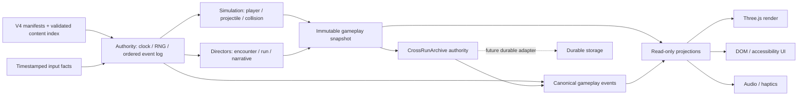

# 1bit STG 工业化架构基线

状态：`FOUNDATION / WIP`

基线日期：2026-07-18

适用范围：`stg-dev/` 与只读内容源 `../1bit-stg-complete-asset-kit-v4/`

本文是工程决策基线，不是完成声明。默认 RUN 已不再推进 legacy `GameSimulation`；`CanonicalRunSession` 只执行当前有 authority 证据的 `quiet_awakening → common.eye_acquisition`。First Eye 的一次性 occurrence `run:first-eye:0` 接入 `CanonicalRunCombatState`：run-owned player/evidence/graze/Override 与 exact-tick bus 跨 occurrence-local projectile drain 保留，released kernel 不再被推进，空档由 shared state idle advance。First Eye 的 projectile/residue drain、gaze clamp/release 与 Flower recovery 是三道独立交接门；当前 V4 未定义 Flower recovery timing，所以 session 不伪造 ready handoff，也不用另一套玩法语言填补空白。浏览器默认显式提供不合格的 device-neutral gaze sample，因为 V4 没有定义设备映射；即使 combat 已 drain 仍保持在 `first_eye`。

`CanonicalCombatKernel` 目前直接执行 48 个 executable pattern 中的 23 个，还剩 25 个；供 live admission 消费的 exported `SUPPORTED_CANONICAL_COMBAT_PATTERN_IDS` 仍严格保持 20 个。第 21、22、23 个 `room.polarized.clock_decree`、`room.polarized.no_dusk_grid` 与 `transition.room_threshold` 只存在于私有冻结的 direct-kernel 隔离列表，不因此获得 composer、scheduler、selection、transition 或 session 权限。Ballot、Crack、Unstable/Alternating、One Sun、Context 与 Rain 的已记录 authority seams 保持不变；`boss.two_claims.phase2` 仍在未支持的 25 个 pattern 内。`transition.dusk_settle` 仍只保留 inert `snapshot_capture_ready`；加入 isolated Override Void 与 Room Threshold 后 TRANSITION 为 3/3，但没有 live transition chain。INFORMATION 保持 3/4、IN_BETWEEN 为 1/4、POLARIZED 为 4/4、weather echo 2/3；默认 RUN 仍只装配 `common.eye_acquisition`。

四个 Boss pattern（4/8 rigs、4/24 Boss patterns）均只在 rig `observe` phase 明示 `laserGeometry:null` 的边界内接入；pattern 的 family laser association 不会启动 active laser，phase-exit evaluator、resolution/terminal 与 phase2/3 仍未支持。纯 `RunComposer`、atomic room-transition、`LiveRunAdmission` 与 `admitLiveRoomCapability` 继续保持 no-bus/no-composer/no-schedule。Rain 只通过 caller-resolved parallel member 的 capability/membership/seed 防火墙校验；Context Switch 与 Ballot Shift 也只作为 caller-resolved singleton room capabilities 通过 membership/seed/segment 校验。Ballot 的归一化 artifact hash 为 `fea078a46315927d2f145be380ad7f38e6cbfef154e95337fd1ac9c90dcdc2a7`。POLARIZED pair `0659e91c…ba820` 仍是 admitted data evidence；新增的 singleton Alternating fixture 则固定为 `36da160c…24131`，只供独立 executor 重新验收，而且该 executor 必须在创建 bus 前拒绝 pair。Clock Decree 与 No-dusk Grid 都不是新 admitted fixture：其 exact singleton 在 exported 20-pattern 边界以 `unsupported-pattern` 拒绝，输入 gameplay hash 分别为 `43bf1afb9a26ccbe5430a013e66feabf63d481b55d303aee328a237c192007e2`、`cc6c9636b2dd90d8b289d1d68fe7048ea1025c5cf01dea27e6912b047c7307b8`。Room Threshold 是 direct-only transition pattern，不是 room-admission fixture，也不会因 TRANSITION 3/3 变成 atomic transition/composer authority。完整 plan 仍因其它 capability 缺口拒绝，且两种 admission 都不选择、不组合、不排程、不执行 kernel。现有 room-capability fixtures 是 POLARIZED pair、singleton INFORMATION stale、singleton IN_BETWEEN Context、singleton FORCED_ALIGNMENT Ballot，以及同时供两条 exact READ consumers 重新验收的 singleton POLARIZED Alternating 与 Left/Right fixtures。历史 mixed encounter envelope 仍隔离为 non-live `EncounterEnvelopeFixture`。序章的 Full/Reduced Motion/Flash-Off 已有同 authority trace 浏览器证据，但完整 Run 的 accessibility graph、其余25 patterns、Boss/active-laser/narrative 组合、durable archive/restore boot、IndexedDB 与性能门禁仍未完成。

`src/authority/live-room-session.ts` 是与 no-bus admission 分开的精确执行 adapter。它只重新验收 hash `b6a1eddf…d1c` 的 Left/Right Gate raw fixture；metric capture tick960 之后先保留 fragment 外的 telegraph520ms + entry800ms elapsed authority，第一合法 READ 起点为 `S=1119`。到达 caller-established `S>=1119` 后才创建内部 event bus/shared run state；material settle、rest、residue 与 fixed close 分别在 `S+1224/+1350/+1540/+1542`。`S+1542` 由 `closeSlice()` 用内部 neutral frame 关闭，只接受 occurrence 已释放且 run timer 静止的状态，不能消费 caller gameplay input 或留下未拥有的 timer。nested kernel 的 ready 只暴露为 `occurrenceLifecycleReady`，顶层 room/run completion 与 handoff 恒为 false。它不选择/组合房间、不调用 room transition，也不是 director、scheduler、默认 RUN 或 renderer path。

`src/authority/alternating-verdict-read.ts` 是第二个彼此独立的 exact consumer，只重新验收 singleton hash `36da160c…24131`。raw seed `0x12345678`、14 项 metric tick960、salt `0x2200`、resolved seed `0xe9f333c4`、parallel-none selection seed `0x1234ba38` 与 `520/800/11600/900/1600/520ms` 六段标量都由 fixture 固定；selection seed 被验证但不在 fragment 内消费 RNG。telegraph+entry 同样只作为 fragment 外已经历的159 ticks，所以 `S>=1119` 才能创建内部 bus/shared state。material settle、rest、最后 lifecycle release 与 neutral close 位于 `S+1392/+1500/+1683/+1692`；pair、parallel member、错误 seed/segment/tier/pool、hostile descriptor 与 overflow 都在 bus 分配前拒绝。顶层 completion/handoff 永远为 false；它不执行 telegraph/entry、不声明 incoming safe gap、不进入 composer、scheduler、transition、weather、persistence、session、renderer 或默认 RUN。

route-present `SnapshotAuthority`、in-memory `CrossRunArchiveAuthority` 与 `CrossRunRestoreAuthority` 已实现为三段彼此分离的 authority，不是 live boot 接线。`RunMemoryRecorder.finalize()` 深冻结返回值，并通过私有 WeakMap 只为 exact in-memory result 铸造 opaque token；raw/clone/parse/persist/tamper 不能恢复 provenance。Snapshot 以 module-local draft 与 runtime-private capture 抵抗 own-method shadow，在偶数起点 `T` 的 tick `T/T+50/T+98/T+196` 发 begin/serialize/present/complete；serialize 成功后才铸造与 exact bus、原 token、payload 与 tick 绑定的 receipt，Snapshot 自己仍不发 cross-run event。Archive 只接受该 receipt，并强制 persist tick 精确等于 serialize tick；每个 run ID 只接受一次，保留原 recorder token 给隔离 Restore，但不拥有 browser storage、session boot、restore 调度或 narrative handoff。Narrative 在所有 projection/state mutation 前校验 snapshot/archive lifecycle 与 hash/seed/route/material identity；complete 或两个布尔事实都不能补写 archive acceptance/handoff。Restore 的共享 ledger 在 intrinsic event-bus batch 成功后原子锁定 previous-run identity、route digest 与唯一 next-run target；material → actual ghost → residue → witness → input 顺序及 route960ms 的 tick `0/52/166/200/252` 已锁定。三者都未接 session、renderer、durable storage/IndexedDB 或 null-route。NarrativeAuthority 还删除了 `FIRST_CLAMP_RECOVERY` 的 gaze-only/room-swap bypass；缺少独立 `flower.recoveryComplete` fact 时保持停驻。

通用/live active-laser phase 仍未装配；唯一窄例是隔离单测的 run-scoped `CanonicalMisreaderEnforceEntryFragment`。它只组合 canonical Misreader `observe → enforce` 与一次 laser start，提交 phase-2 attack-plan 事实但不执行 phase-2 projectile emitters，不接 `CanonicalRunSession`、room admission/scheduling、renderer 或默认入口，也不计入 23/48 direct-kernel pattern coverage。

## 1. 权威来源

权威从高到低如下：

1. `../1bit-stg-complete-asset-kit-v4/manifests/**`：V4 数据契约；
2. `../1bit-stg-complete-asset-kit-v4/runtime/**`：V4 60Hz 参考运行时与行为 oracle；
3. `../1bit-stg-complete-asset-kit-v4/gameplay/tools/sim_core.py`：pattern QA oracle；
4. `src/content/**` 与 `src/authority/**`：验证后的生产 authority adapter；
5. `src/game/**`：应用/表现集成；默认 RUN 通过只读 presentation adapter 消费 authority snapshot，Pattern Lab 仍包含 legacy simulation；
6. Three.js、DOM、音频、触觉和 PWA：只读投影，不拥有玩法事实。

当实现和 manifest 冲突时，先修实现或提出有证据的 Extension ADR，不得静默修饰数据。V4 素材包在应用运行时视为只读；开发服务器通过 `vite.config.ts` 的 `server.fs.allow: [".."]` 读取它。

`src/content/content-authority.ts` 与 `tools/content/validate-content.ts` 已展开 13 个 canonical entrypoint，检查版本、ID、引用、物理文件 universe 与 SHA-256，并让 dev/build 在漂移时 fail-fast。`src/main.ts` 仍有面向应用装配的直接 JSON import；后续 adapter 必须只消费经过该边界验证的 registry，不能另建第二套内容索引。

## 2. 权威核心与投影分离

### 2.1 核心可以做什么

- 消费带 tick 的输入事实；
- 推进确定性时钟和 RNG；
- 改变玩家、弹体、房间、Boss、叙事与 Run 状态；
- 产生 72 个 V4 canonical event 中定义的事件；
- 形成不可变 snapshot、event trace、run memory 与 archive record。

### 2.2 投影只能做什么

- 根据 snapshot 或事件更新画面、UI、声音和触觉；
- Reduced Motion、Flash-Off 等可替换/缩短视觉，但不得改变事件时间、payload、顺序、碰撞或 RNG；
- 失败时降级或静默，例如浏览器拒绝手柄振动；
- 不得调用 gameplay command、推进 narrative transition、生成碰撞体或回写 ledger。

`src/game/renderer.ts`、`src/game/audio.ts` 和 `InputManager.pulse()` 已按这个方向工作。First Eye 目标只读已提交的 gaze state：`idle` 投影 V4 `eye.reveal`，`acquiring` 投影 `eye.acquire`，`clamped` 与 `release-delay` 投影 `eye.read`。Eye 属于 First Eye phase，不会在 combat drain 时随 `patternComplete` 消失；画面帧也不能倒推 gaze 事实或推进状态机。`gaze_reading_cone` 是由 warning/emitter/motion 上界生成的非碰撞稳定轮廓。dead/respawning/run-ended 只读 player snapshot；当前选择 ADR 中公开的 V4 稳定代表帧，并明确不把它们声称为已实现的 event/tick-bound clip phase。目前仍没有编译期依赖门禁；P0 要用目录依赖测试或 lint rule 禁止 `projection/presentation` 反向 import `authority/simulation/directors` 的 command API。

## 3. 目标模块边界

| 模块 | 单一职责 | 允许依赖 | 当前映射/状态 |
|---|---|---|---|
| `app/` | 启动、RUN/LAB 模式、装配 | 全部公开端口 | 目前集中在 `src/main.ts`，待拆分 |
| `content/` | schema、索引、ID、hash、provenance | V4 JSON/asset | Content Authority 与 build preflight 已实现 |
| `authority/` | clock/event、pattern、player/projectile/laser、encounter/Boss、snapshot/narrative | `content/` | canonical 序章、V4 GazeMachine adapter、23-pattern direct-kernel combat family（exported live-admission registry 仍为20，Clock Decree、No-dusk Grid 与 Room Threshold 仅在私有隔离列表）、彼此独立的 exact Left/Right 与 Alternating Verdict READ-only execution fragments、route-present snapshot/in-memory archive/restore、隔离 Misreader entry fragment、receipt-bound prepared Boss+laser/player seams、QA RunComposer、atomic room-transition、bus-free LiveRunAdmission 与 non-executing room-capability admission 已落地；composition/scheduling、通用 room chain、durable archive/restore boot/persistence 均未 live 接通；旧 encounter envelope 只保留为无 canonical bus 的 non-live fixture |
| `simulation/` | 玩家、弹体、碰撞、池、空间查询 | `authority/`, `content/` | run state 拥有 player/evidence/graze/Override；每个 kernel 只拥有 occurrence-local RNG/schedule/projectile pool；Misreader laser 只作为隔离 run occurrence；legacy `GameSimulation` 只保留在 Pattern Lab |
| `gameplay/` | 48 pattern、12 operator、laser、safe gap | `simulation/`, `content/` | NORMAL oracle 覆盖 48/48；生产 kernel 直接执行23/48：Clock Decree 的 dual-clock XOR + 量化 triangle phase corridor、No-dusk Grid 的双 emitter-owned XOR clocks + `binary_cross` cusp-segmented phase mask、Room Threshold 的 opposing speed envelopes + continuous sine collision mask、One Sun 的 turn-before-linear + continuous identity-retaining constraint、Ballot 的 pattern-global dual-clock speed/collision gate 与 motion-retaining phase collision mask、Context 的 post-motion continuous `operator_constraint` redirect、Rain 的 post-RNG full-local-vector `rain_lee` swept omission、Crack 的 generation-owned seam mirror/continuous path、Dusk linear settle、Override Void full-360 ring/one-time offset seam/visible rule clip、Unstable/Alternating 的 declaration-ordered old-heading sweep→zero-time turn、`paired_fan`、signed lateral wall/lane omission、Notification Overflow 与 Wind Bias fixed-tick local field、hard-cut/stale/Absent-Receiver step envelopes，以及 visible rule clip；Clock、No-dusk Grid 与 Room Threshold 只在 direct kernel，不扩大 exported 20-pattern live registry；应用 checksum/tests 补上 Python oracle 近似与 120Hz declared behavior 之间的显式缺口，且不把 pattern-specific safe-gap enforcement 计为新增通用 operator |
| `directors/` | encounter、room、run、boss 调度 | `authority/`, `gameplay/` | `CanonicalRunSession` 只拥有序章、shared combat state 与三道 First Eye barrier；Misreader fragment 没有 session/room 排程入口。严格串行连续性已建立，Left/Right 与 Alternating READ fragments 也各只消费一个 exact caller-resolved slice，不是 director；`RunComposer` 仍只是精确 QA oracle，atomic room FSM 未接线，`LiveRunAdmission` 及 room-capability 入口也只拒绝/验收显式 facts，不执行调度；历史 `EncounterEnvelopeFixture` 已隔离且无 canonical bus，完整 encounter/room/Boss Run 未装配 |
| `narrative/` | 16-state machine、witness、snapshot、cross-run | `authority/`, `directors/` | reducer 与 route-present snapshot/in-memory archive/restore authority 已有；Flower recovery-complete producer、durable archive、live boot/renderer、null-route 与持久化未完成 |
| `projection/` | 将事件/snapshot 转成无副作用 view model | 核心只读端口 | `src/game/presentation.ts` 已投影 canonical RUN；尚未拆成独立目录 |
| `presentation/` | Three.js、DOM、audio、haptics | `projection/` | `renderer.ts`、`audio.ts` 已有基础 |
| `platform/` | keyboard/pointer/gamepad、PWA、IndexedDB | app 端口 | 输入/PWA 已有；IndexedDB 未完成 |
| `testkit/` | trace fixture、oracle、fake clock、benchmark | 核心公开端口 | 零散 fixture 已有，待集中 |

目标不是为了目录数量而拆分。每次拆分必须消除一个权威歧义、测试盲区或循环依赖；否则保持现状，遵循“做减法”。

## 4. ADR-001：120Hz master 与 V4 60Hz runtime 共存

状态：`SCHEDULER IMPLEMENTED / MACHINE ADAPTERS WIP`

### 背景

- 48 个 executable pattern 声明 `tickHz: 120`；默认 RUN 通过 `AuthorityClock` 逐个消费整数 `tick120`，Pattern Lab 的 legacy `GameSimulation` 仍以同一 master cadence 固定步进。
- V4 `runtime-contract-v4.json` 的参考步长是 `16.6666666667ms`，即 60Hz。
- 把全部系统粗暴改成 60Hz 会损失 pattern 与碰撞精度；把 V4 reference machine 粗暴调用到 120Hz 会改变 canonical timing 和 trace。

### 决策

1. 120Hz 是唯一 master tick。核心内部以整数 `tick120` 保存时间，不以不断累加的浮点毫秒作为身份。
2. V4 60Hz runtime machine 是 due-time consumer：每两个 master tick 推进一步，边界为 `tick120 % 2 === 0`。
3. 时间序列化为 `tick120 × 1000 / 120`；比较与排序使用整数 tick、domain priority 和 monotonic sequence，不比较近似浮点数。
4. 浏览器 `requestAnimationFrame` 只提供 elapsed budget；权威核心逐 tick 消耗 accumulator。大 delta 必须遍历每个被跨越的权威边界，最多遵守 V4 的 `maximumBoundariesPerAdvance: 1024`，不得直接跳到最终状态。
5. Pause 冻结 gameplay clock；render/audio clock 可继续做非权威过渡，但恢复时不得吸收 pause 期间 wall time。
6. 同 seed、初始状态与按 tick 输入必须产生相同事件 ID、tick、payload 与顺序；帧率、Reduced Motion、Flash-Off、音频/触觉可用性不参与 RNG。

生产 `requestAnimationFrame` 不再预先截断 wall delta；它把完整非负预算交给 `AuthorityClock`。1024-boundary cap 与剩余 backlog 的保留/后续 drain 只在 clock 内实现，避免长帧或后台恢复静默丢失 gameplay time。

### 为什么不采用其他方案

- 全部 60Hz：不能满足 pattern manifest 的 120Hz authority，也减弱高速弹体的可重放性。
- 全部 120Hz：破坏 V4 参考 runtime 的 due-time 与 trace parity。
- 两个各自累加浮点时钟：长 Run 后会漂移，并在同 timestamp 上产生不稳定顺序。

### 完成定义

- 有 dual-rate scheduler 单元测试与长时间无漂移测试；
- atomic room-transition 的 240/500/650ms 依次落在非提前的 60Hz 偶数 master tick，large advance 保留原 due tick；
- V4 reference runtime 与本工程 adapter 在 canonical fixtures 上 trace parity；
- 30/60/120/144Hz render cadence 和 100ms large delta 产生同一 gameplay trace；
- pause/resume、后台恢复和 PWA 离线启动不改变权威 tick。

## 5. ADR-002：同 timestamp 的提交顺序

状态：`AUTHORITY BUS IMPLEMENTED / APPLICATION ADAPTER PARTIAL`

任何相同权威 timestamp 的事件必须按以下顺序处理：

1. `collision-disable`
2. `state-or-damage-commit`
3. `collision-enable`
4. `entity-spawn`
5. `feedback-dispatch`

实现要求：

- 状态先变，事件后观察；fatal/non-fatal damage 只能有一个原子分支；
- 碰撞由 owner lease 管理，不允许 presentation 直接 toggle；
- 一帧多个命中候选先稳定排序，再至多提交一个合法玩家伤害；
- spawn 在该 timestamp 的 collision/state commit 后出现，不能倒推触发已完成的命中；
- feedback 永远最后，且无法生成 gameplay event；
- 排序 key 固定为 `(tick120, phasePriority, entityStableId, localSequence)`。

`CanonicalEventBus` 已从 V4 schema 派生 72 个 ID，提供 required-payload、occurrence 去重、同 tick 排序、原子 batch 与只读 feedback 边界；默认序章的 Flower、player 与 projectile 通过同一 run-scoped 队列提交事实。`CanonicalRunCombatState` 对该 bus 取得不可逆 lease：只接受 `closedThroughTick120 + 1` 的 draft，ambient `flush()` 与第二 owner 永久拒绝，且每个 tick（包括没有 event 的安静 tick）只能由 state close 一次。kernel 的 `advanceTick()` 可在 close 前让 gaze/Flower/coordinator 添加同 tick 事实；occurrence release 只有在该 tick 成功 close 后才生效。event draft、batch 与 JSON array 都先捕获 plain own-data descriptors，accessor/virtual-array/reentrant mutation 在 append 前 fail closed。

这个 lease 是 tick/event ownership，不是通用 rollback transaction。`enqueueBatch` 只保证一组 envelope 在 append 前完整验证，不能回滚另一个 authority 已经发生的内存 mutation。Boss begin/swap/resolve 与 laser active-entry/terminal/cleanup 的各自多事实边界已在 mutation 前整批验收；Misreader entry 另以 exact bus 签发的 one-use receipt 绑定 Boss phase-exit 与 laser-start 两组 proposal，在一次 append 后应用两个预计算 after-state。Player damage 也要求同 bus/同 draft-group receipt；过期、错组、复用或未 append 的 proposal 不能改变状态。这些是窄范围 prepared capability，不是能撤销任意 sibling mutation 的事务。通用 player-damage→projectile-impact composite 仍缺失；Misreader contact 刻意只伤害玩家，不发 impact、不终止 beam。V4 schema 没有 standalone Boss rupture event，因此已删除原先无 bus 证据的 rupture mutation，material remainder 只随受理后的最终 resolution 保留。局部 Override 虽由 combat kernel 实现和验证，但默认 fragment 在 `LOCAL_RESISTANCE_AVAILABLE` 之前不转交其输入；Misreader fragment 则因没有被创作的单一 beam scar 坐标而拒绝 Override edge。Pattern Lab 的 legacy `GameSimulation` 仍产生自己的 local observation trace；在其余 patterns 和完整 Run 装配该 bus 前，不能宣称整个应用已完成本 ADR。

Projectile authority 对 exact-arm cancellation 使用整批预提交：尚未 activation 的同 tick 目标不产生瞬态 `collision.on`；已经 activation 的同 tick terminal command 在任何 mutation 前 fail closed。非法 move/impact/cancel 输入也必须在推进任何目标或无关实体前拒绝。Player recovery 与新 damage 同 tick 时同样抑制过期的 transient collision-on。

## 6. 确定性、快照与持久化

- 当前 fragment 的 First Eye combat RNG 使用 `mulberry32-v1` 与 caller-resolved encounter seed；完整 Run root seed/salt 派生尚未接线。未来 replay header 必须记录已解析 seed、输入 trace、content digest 与 engine version。
- shared kernel 必须提供一次性 Unicode-scalar `occurrenceId`；entity/occurrence scope 使用 UTF-8 byte-length prefix `combat:<bytes>:<occurrenceId>:<patternId>`，不能依赖分隔符猜测或复用旧 occurrence。
- 任何 `Math.random()`、`Date.now()`、设备像素比或 render delta 都不得进入权威状态。
- Snapshot 负责“观察—序列化—呈现当前 Run”；Archive 接受不可变 record；Restore 只在下一 Run hydrate。三者不得合并，当前 archive 只持有内存 token，不等于 durable persistence。
- 当前 `SnapshotAuthority` 只接受 recorder-issued route-present token，并在首个不早于 V4 410/810/1630ms 的 runtime60 偶数边界发出四个 snapshot event。serialize append 成功后，它铸造 exact bus/token/payload/tick-bound receipt，但自身不发 `cross_run.*`。`CrossRunArchiveAuthority` 只在同一个 serialize tick 消费该 receipt，以 intrinsic append 写一次 canonical persist event，并按 run ID 不可覆盖地保存原 token；拒绝不会新增 archive record 或 event。若 occurrence key 早已被占用，该既有 bus fact 仍保留并使同 bus 重试永久失败。Archive 不拥有 storage、session、restore 或 handoff；只有 authored terminal narrative path 才能投影 `handoffReady:true`。
- Cross-run material 的顺序是 `overrideScar → deathTrace → burnIn → actual ghost route → ghostResidue → witness orientation → returnInput`。
- 存储失败不能重写当前 Run 结果；应保留内存 snapshot、显示非评价性状态并允许导出诊断包。
- IndexedDB 的 schema/version migration、原子 transaction、quota/损坏恢复属于 P1；P0 先完成纯函数 recorder、canonical serializer 与 hash。

### 6.1 显式 adapter policy

当 V4 没有给出生产所需参数时，adapter 不把选择写成 canonical 事实，而是将数值与 provenance 放入不可变 snapshot/policy：

- combat 接线显式提供 graze radius、通用 projectile damage 与 archetype→pool-class mapping；
- Quiet Awakening 选择 8000ms，并在该边界之后继续等待 2 次 movement/signal rising fact；同一 tick 同时 rise 只记一个 aggregate fact，避免单指触控获得双倍权重。binary signal 使用 V4 AWAKENING 低强度带的两个端点 `0.3/0.5`，Focus 只执行 `0.35` 上限；60 秒 fallback 同样公开在 policy 中；
- run 序章记录 First Eye 的 `INFORMATION` room、`EASY` difficulty 和“调用方已解析 V4 encounter seed”的 seed authority，不自行发明 manifest 未提供的 difficulty salt；URL 中显式 seed 若不是十进制 uint32 则启动 fail closed，不回退到随机数；
- fresh-session bootstrap 明确上一局 material/ghost/witness 均不存在，不合成 restore event；First Eye handoff 保留 occurrence-local complete/drain/live-entity 事实，并从当前 shared player/Override timers 判断 run quiescence，不能把 release 时的旧 snapshot 当作永远不变的 handoff；combat drain、gaze clamp/release 和 Flower recovery 继续保持独立 barrier；
- gaze 输入是调用方显式提供的 device-neutral sample，不从 renderer 或设备类型推断，也不随 player death/respawn 被改写。V4 GazeMachine 在连续 60 `tick120` 合格样本后 clamp，在 54 `tick120` 失配延迟后 release；其事件与 Flower 使用同一 ordered bus，clamp 强制 Flower `0.1`。runtime 阈值按 authority 顺序优先于叙事 raw guard，canonical→narrative identity projection 在启动时 fail-fast 验证；
- V4 没有给出 Flower recovery 的 delay/duration。单元 authority 可进入 `first_clamp_recovery` 并提交 gaze release，但必须保持 `flowerRecoveryComplete: false` 与 handoff not-ready，直到未来 authority 有可验证的 timing；
- 负 aim lead 从被跨越的精确历史 `tick120` 取样；正 aim lead 在当前 adapter 中使用“最后一段 authority 移动线性外推”。后者是待 V4 或更高层 authority 消解的显式缺口。
- `room.forced.left_right_gate` 按 V4 声明执行 signed lateral drift 与 lane omission；不可变 Python `sim_core.py` 没有执行这两项，所以 Python trace hash 不能证明应用轨迹 parity，只作为 QA baseline，应用侧以 declared-V4 checksum 和针对 operator/omission 的测试封口。V4 只规定 lane index 从左到右，没有定义 geometry count 与 `laneCount` 不同时的投影；生产 snapshot 明示并冻结 `candidate-center-into-left-to-right-lane-bins` adapter，不能把该公式伪称为 Python oracle 事实。
- Left/Right 的 room-level adapter 只授权一个固定 READ slice：raw room-capability fixture hash `b6a1eddf043960a43a3b2af99cadb355932b6ae26fafb9da1563232a642d2d1c`，metric capture `tick120=960`，telegraph+entry 的1320ms向上投影为159 ticks，READ 起点必须因果地满足 `S>=1119`。telegraph/entry 与 incoming safe gap 保持在 fragment 外；520ms handoff 标量既不是 serial window，也不是 spatial overlap proof。最早因果起点的860-event neutral trace hash 为 `0dceca99986974893345ce2d80e7aff31640e3bd551f98835223be2403016695`，86 次 spawn / 99 次 RNG 已锁定。budget 峰值只观察为 arm-or-flight/live-collider `56/56`、all-authority/residue/allocated-micro `77/74/77`；累计 spawn86 不被拿来解释 tier80，执行路径没有 budget policy branch。
- `room.forced.unstable_middle` 的两个 emitter 都逐字执行 `op.linear > op.turn_once`：crossed turn tick 先以旧 heading 完成连续 sweep，随后只改 heading，下一 tick 才沿新方向位移。spawn preflight 使用相同声明顺序；omitted candidate 已消费一次 RNG，但没有 entity/event/residue。report seed `1610616880` 下 E/N/H 的 `candidate=RNG / omitted / spawn / OOB / end` 为 `144/6/138/94/44`、`180/12/168/137/31`、`216/12/204/188/16`；完整 lifecycle event/hash 为 `1380/2ffd9cd25098d60ff8033812580d73fa7de1b3c2abacf8a2eb0b64ad2cdc0ff0`、`1680/175dd9006058b797fc652d666d14a86aaf79b0add900a57523f63652f65ad44b`、`2040/47990c6f57c3492a9a4b03c311137346c12109e5e574fa112db54b7dacbbb052`；tick1392 complete、tick1807 drain，三难度均无 withdrawal/impact/damage。这个 FORCED_ALIGNMENT room pattern 不授权仍未支持的 `boss.two_claims.phase2`。
- `room.polarized.alternating_verdict` 同样执行 literal `op.linear > op.turn_once`，并把 source-index → 一次 RNG jitter → 完整 pre/post-turn swept preflight → entity/spawn 固定为唯一 omission 顺序。report seed `4224146597` 下 E/N/H 的 `RNG / omitted / spawn / OOB / end` 为 `162/12/150/99/51`、`198/15/183/147/36`、`234/15/219/201/18`；完整 lifecycle event/hash 为 `1500/b7f2b9bca9fd76bce42f245cfd4cae302aec8297c19a836e6b38ad4e46e77a7f`、`1830/25a0fdd4617d491a33aa6fa9502af447dc5e6103582844c16ab9a81fddd22969`、`2190/92a7f8055a6703289bae5e570d7e07583cc5c8c7fbf7ade38c5a3e2b7a9c4c87`；tick1392 complete、tick1683 drain，均无 withdrawal/impact/damage。exact READ consumer 的 singleton hash 是 `36da160cd1a63e96a71c6c5978c1d3b73398e177c8b447ef08274c6215824131`；最早 `S=1119` 的 stationary-center neutral trace 有1500 events，hash `21c28e87ea9bdb9fd2a9777fd8f6cc3392209ae5557ede1b766b6d3bcf36bd3c`。digital/live/all/residue/allocated 峰值 `52/52/83/83/83`、spawn150、RNG162、omission12 只属于 `stationary-center-unfocused-graze10-damage1` observation；composer listen `80/2` 与 director EASY `120` 的计数语义未由 V4 消解，执行不设 budget branch。
- `room.polarized.hard_cut_corridor` 复用同一 lane projection，并按 `op.lateral_wall > op.speed_envelope > op.linear` 执行 step envelope `{0ms:1, 420ms:0, 680ms:1}`。exact key 使用左连续值，跨 key 后才更新 snapshot speed；一个 120Hz tick 跨 key 时，弹体位移、玩家相对位移、contact 与 safe-gap preflight 都按时间比例拆成 sub-sweep，静止区间仍保留 collision authority。lane omission 先于 RNG/identity，safe-gap preflight 后于 RNG；Alternating 与 Hard Cut 保留既有 2 个 capability，加上 direct-only Clock Decree 与 No-dusk Grid 后 POLARIZED 为 4/4，但 live room composition 仍未接线。
- `room.information.stale_packet_retry` 按声明签名 `op.linear > op.speed_envelope` 解释为：`op.linear` 建立直线轨迹，后置 envelope 在同一 gameplay-time interval 调制该轨迹的 piecewise-linear base speed。curve 与 envelope 的所有 key 取排序去重并集；每个子区间对线性 curve 做梯形积分、对 step envelope 取区间内部值，snapshot 则保留 endpoint 的左连续瞬时值。arm/activation 期不移动且保留 age-zero audit speed；第一次 flight movement 才投影当前 endpoint speed。spawn-time safe-gap preflight 与 runtime/contact 共用这条 integrator，E/N/H 分别为 `90/110/130` RNG candidates、`10/13/15` omissions、`80/97/115` spawn。V4 EASY cadence 的第十 burst 是 9249.8ms，晚于独立 timeline `emit.end=9100ms`；不可变 Python QA scheduler 与 manifest-derived TS scheduler 都按 `durationMs=9800` 保留它，所以 production 不增加 cutoff，并把该矛盾作为 source tension 而非新 canonical 事实。
- `room.information.notification_overflow` 精确固定 `grid/staggered-rain` 与 `op.lateral_wall > op.local_vector_bias > op.linear`。age-relative 112→154px/s curve 与 11px/s lateral drift 按 curve-key sub-segment 积分；pattern-relative `[12,18]` / 1800ms / 0.45 sinusoidal field 按 V4 在每个 120Hz master-tick endpoint 只采样一次，同一 tick 内因 curve key 拆分的 sub-segment 共用该样本。runtime、moving-player contact 与 moving-window safe-gap preflight 共用同一 segment path。scaled geometry 仍按公开的 candidate-center lane adapter 投影，lane 7 在 RNG/entity identity 前省略；`bullet.micro.dash` 明示映射到 `micro` pool。report seed `1205726097` 的 E/N/H `candidate/lane/RNG/preflight/spawn/OOB/end` 是 `180/0/180/28/152/75/77`、`240/16/224/39/185/106/79`、`288/32/256/46/210/148/62`。Python reference 与 30Hz declared hashes 只作为分层 QA evidence：前者冻结 age-zero speed、忽略 arm/lateral lane behavior，后者仍不是 120Hz authority。EASY 第十五 burst `10634.8ms/tick1277` 晚于 `emit.end=10500ms/tick1260`、早于 `duration=11200ms/tick1344`，因此沿用 scheduler，不发明 cutoff/event。2425ms packet dust 向上跨为 291 ticks，于 tick1635 排空。该 isolated capability 把 INFORMATION 提升到 3/4，但不选择、组合或执行 room。
- `encounter.weather_echo.wind_bias` 精确固定 `WEATHER_ECHO / COMMON`、`bullet.micro.seed → micro` 与 `op.local_vector_bias > op.linear`。`[34,4]` / 1600ms / 0.6 field 只以 pattern-relative 120Hz endpoint sample 进入 shared runtime/preflight/contact segment；weather event、weather seed/RNG 与 presentation/accessibility profile 都是禁止的 gameplay inputs。report seed `1709394890` 的 E/N/H `candidate/RNG/spawn/preflight` 为 `72/72/69/3`、`90/90/86/4`、`108/108/101/7`，production event hashes 为 `20ef8b0405aca18abe447409d3452d3ea22bcd29d045f034abbd9691b9545f19`、`c69bb312fa1da427f4980334369f98a7e8c86f39d3757cd00f4153cb896970c3`、`b36d107625c6c1f9f45792108cd6a21293304e708404f8e08200df35d158640b`。pattern tick1152 完成，3143ms residue 向上跨 378 ticks，并于 tick1530 排空。四个玩家 room、render cadence、backlog 与 presentation weather trace-identical；但没有真实 weather authority 或 parallel scheduler。Wind 与 Rain 合计只把 weather echo 提升为 2/3；`missing_ack` 的 child arm/phase gate 仍未解析，不得靠推断接入。
- `encounter.weather_echo.rain_packets` 精确固定 `grid/uneven-droplets`、`bullet.micro.dash → micro` 与 `op.local_vector_bias > op.linear`。`laneX:[]` 表明它没有 lateral-wall/open-lane lattice：每个 source-index 候选按 manifest 顺序先消费一次 pattern RNG jitter，再让 `[8,30]` / 2100ms / 0.35 endpoint-sampled field 的完整 120Hz path 对移动 `rain_lee` 做 swept preflight；通过后才分配实体，省略项没有 residue。report seed `1771193663` 的 E/N/H `candidate/RNG/preflight/spawn/OOB/end` 为 `140/140/21/119/46/73`、`195/195/29/166/71/95`、`225/225/39/186/107/79`；production event hashes 为 `869d1ee119a4a772698c27a769386cf02fcca1a06b09521e085e1b2f306a308d`、`afd1dde61a6bc1b076571813e2b065bed8ca536b2d8d947e43cf66f0ff8038c7`、`1829f3539e67f76b8013d73ef10242369f59909d58b7f1b439772db013aca8d9`。Python/reference 30Hz intervention `20/28/35` 只作为分层 QA evidence，不能证明 production 的连续 omission `21/29/39`。EASY 最后一次 cadence 在 `8885.2ms/tick1067`，晚于 `emit.end=8700ms` 但早于 duration，仍被保留；tick1128 complete，456-tick `wet_packet_pulp` 最晚于 tick1584 drain。测试另锁 nonzero start、graze522/impact533、四 room、30/60/144Hz/backlog 及 presentation weather/accessibility parity。真实天气、parallel scheduler、multi-pool execution、session、默认 RUN 与 renderer 仍无写入或执行入口；caller-resolved admission 只验收 parallel-member facts，不执行它。
- `room.in_between.context_switch` 的 `operator_constraint` 是 safe-gap enforcement，不是可以被任意 pattern 选用的第十三个通用 motion operator。每个 master tick 先按声明顺序执行 A 的 literal `op.linear > op.turn_once`，以及 B 的 linear `{0:0.72,520:1.28}` `op.speed_envelope > op.turn_once > op.linear`，再处理走廊约束。所有 scheduled candidates 都先消费 RNG 并获得稳定 entity identity；没有 spawn preflight omission，也绝不以 `source_withdrawn` 终止。约束用相对正弦导数极值分区与固定 52 次二分找连续首次进入，contact path 是 safe prefix 加解析曲率上界外移的 boundary chord；命中后按 Python 来源在当前 endpoint 做 left/right edge snap 与 signed `±8°`，同一 generation 以后仍可再次 redirect。report seed `2740011774`（manifest base `2740017633`）的 E/N/H 30Hz `emission/candidate/intervention/hash` 是 `19/122/104/43c0ccdeed148b1608137f2db353d90fb89a53361a86a0bc4f263007eadcc30d`、`20/169/154/eaee02492d1be50f8df214f226ffe8be568b89b35085e25e3a9fa4ec5657846c`、`20/198/273/4cc95eb7f32cce086ddf5ff8cee009f4602664dfdb346a09a32f81c534578577`；reference 与 declared hash 相同，只作分层 QA evidence。120Hz production 的 `candidate/RNG/spawn/source-withdrawn/OOB/end/residue/redirect-left/redirect-right` 是 `122/122/122/0/75/47/82/93/49`、`169/169/169/0/120/49/99/110/50`、`198/198/198/0/166/32/103/215/121`，event hashes 为 `7cb60b23323a16da617297daec9b3ce437cc1246e56b28f629b3288eff163bb0`、`99a2e087c38cbdd977766c3c3133d3ae8f3c6682ab7ce61f92fce524c0a9a1fb`、`b5a55f8da9c3a317289c8d871a1ad31c2a91973e5f8f923f3350496c37cb2855`。EASY 最后一次 A cadence 在 `11398ms`，与 `pattern.complete` 同投影到 tick1368；六个 late bodies 仍先取得 spawn identity，再在同 tick canonical phase order 下直接进入 `pattern_end` residue，永不发 collision-on，最后于 tick1746 drain。测试另锁 nonzero start、graze/contact ordering、redirect 后的 Override ordered path、30/60/144Hz、backlog 与 presentation profile parity。它不接 session、room scheduler、renderer 或默认 RUN。
- `transition.dusk_settle` 精确固定 `grid/decreasing-density`、`rule_clip_with_residue` 与 `op.speed_envelope > op.linear`。线性 envelope 对每个 120Hz 子区间做解析积分，endpoint snapshot 保留连续瞬时速度；弹体 arm 前不移动，停驻后仍保留实体 collision authority但永远不进入 player band。report seed `924053617` 下 E/N/H 的 candidate/RNG/spawn/pattern-end 都为 `63/63/63/63`、`84/84/84/84`、`98/98/98/98`，production hashes 为 `9867ff2413c15077d0ad7b5d487a65384de3f47be2d11de791f26b8bfe35776a`、`cbc7a1f93f73a9e6a68fa59fd34b4a91923bbcaa4db1c0b4d22ee1b2339797df`、`97dc90a77e51700d393f90d72ef4988964d4c1a7e89dc8342a876186f5b6289f`。tick984 cancel 后 3424ms sediment 向上跨为 411 ticks，于 tick1395 排空。`snapshot_capture_ready` 只被 strict validator 保留，不由 kernel 求值或投射；director、snapshot、archive 与其他 occurrence cancellation 都不在该 capability 内。
- `transition.override_void` 精确固定 `ring/directional-void`、full-360 等分 headings、`op.linear > op.seam_transform(mode:offset)` 与 moving `directional_override` 走廊。E/N/H 每次 burst 有 `12/16/19` 个 ring body，4 次 cadence 全部保留 `48/64/76` 个 RNG/entity identity；每个 generation 在 inclusive arrival/departure 首次 crossing 按运动方向只做一次 signed `±22px` offset，heading 不变。runtime 先提交 linear sweep，再提交零时长 offset-discontinuity sweep；contact、visible `rule_clip_with_residue` 和显式 DirectionalOverride 都消费两段。safe-gap follower 在 E/N/H 可见撤回 `2/3/4` 个 body，事件顺序是 `projectile.collision.off(source_withdrawn) → projectile.cancel.commit(source_withdrawn) → projectile.residue.begin`；若同 tick 也扫入玩家 Void，该 rule clip 优先，不得再提交 Override terminal 或把它写入关联 scar。只有另行启动的 DirectionalOverride authority 可在真实首次取消位置提交 scar；pattern 声明的 `scar_coordinate_commit` 只被严格验证，保持 inert。tick912 pattern complete，`override_scar` 最晚 tick1258 排空；E/N/H complete/drained event hashes 分别为 `193dbe2b…d769b` / `f00bd4fe…9303f8`、`0222f436…cce43` / `5c62bd0b…0c251`、`6cbfe5b2…d7e51` / `6709ae5a…57d`。该 isolated kernel 拒绝 shared-run state，不求值/消费 `evidence>=overrideCost`，不进入 director/session/composer/scheduler、room transition/event、Snapshot/persistence/handoff、renderer 或默认 RUN；无新 asset、event ID、dependency 或 gameplay language。
- `transition.room_threshold` 精确固定 7800ms duration、timeline ticks `[0,89,89,468,852,886,936]`、`threshold_bridge/phase_gate`、departing `line` 的 8 bodies、128px/s、`1→0.55` envelope/6 bursts，以及 arriving `fan` 的 6 bodies、146px/s、`0.55→1` envelope/5 bursts。phase gate 以连续正弦走廊对完整 swept segment 做可逆 collision mask，不冻结 speed-envelope motion，不删除 RNG/identity/generation。E/N/H candidate 为 `61/78/89`，immutable QA hashes 为 `46f93363fad94f5e8df59e793844758737cbbe0887e63a95d4228fd9692b4c8e`、`0c483797777dc1fcdb1102982ad58d618422f0acd25729f892e2d93f45b42c8c`、`7f2600cfa4ca0a2cceb26dcdcb7759c032290e7bd0e878b8d9759270a2d77aff`。tick936 production 的 `active/removed/allocated/peakLive/hash` 为 `61/0/61/55/36e3b5c5…a6ae`、`76/2/78/75/92d7ea69…07d5`、`87/2/89/86/c48b285b…d9e59`；2741ms `threshold_sediment` 向上跨 329 ticks，tick1265 full-drain hashes 为 `dc6a4490…825b`、`ebba622f…168b9`、`f63a5bc9…5e072`。它没有 resolution hook/laser，不调用 atomic `RoomTransitionAuthority`，不进入 director/session/composer/scheduler、room completion/handoff、renderer 或默认 RUN；TRANSITION 3/3 不是 live transition-chain 完成声明。
- `room.forced.crack_fall_loop` 精确固定 `grid/seam` 与 `op.linear > op.seam_transform`。每个 generation 在 inclusive 首次 departure/crossing 时只做一次 mirror；runtime 把 pre-mirror 线性段与零时长镜像 discontinuity 按序交给 player/graze/Override。动态安全走廊先用相对正弦导数极值分区，再做固定 52 次二分；redirected contact 只使用已证明安全的 prefix 与按 `A·ω²·Δt²/8` 曲率界外移的 boundary chord。Python endpoint edge snap 与 signed `±8°` 是显式 oracle adapter，不声称 continuous 120Hz parity。Directional Override 的 prepared ordered-path port 只接受 exact pool-owned、同 tick、active generation path，先完整 preflight，再把 collider 移到真实 first hit（包含 `t=1`）后 cancel/scar；presentation 不可调用。report seed `3074674485` 下 E/N/H candidate/RNG/spawn 是 `90/90/90`、`120/120/120`、`140/140/140`；redirect 为 `98(49L/49R)`、`49(25L/24R)`、`73(1L/72R)`，OOB/end cancel 为 `59/31`、`96/24`、`128/12`。production event hashes 为 `7b3e9adcc1b71329e5df851949d376a3f02cc19b51613e9648429af61d6496b8`、`22af3f70c7f67589db56e98ac7fc4a3f4e2f1d4c0d1dd212fbf4b73ad4d1ac48`、`2ca79d498e7b0a53a51993ec23974a652f726d50f137011695fd0c807289a2f4`；tick1320 完成、tick1782 排空。该 capability 不接 room selection/admission/scheduling、session 或 renderer，既有 caller-resolved artifacts 不自动改变。
- `room.forced.ballot_shift` 精确固定双 emitter `op.dual_clock_gate > op.linear` 与 `lane_switch/phase_gate`。dual clock 只读 pattern-relative 整数 `tick120`，以两个 duty window 的 XOR 决定同 generation 的速度/碰撞 lease；关闭期速度为零，开启边界只提交 collision-on，该 tick 仍静止且不参与 contact，下一 tick 才移动。独立的 phase gate 在 linear endpoint 仍提交的前提下，用连续 swept segment 检测移动 lane corridor，仅屏蔽侵入实体的碰撞；被 mask 的数字身体仍保留 RNG/identity/generation，也仍可被 Override 在实际位置 cancel/scar。projectile pool 先为当 tick 全部 collision transitions 生成一次性 prepared batch，只在 exact retained bus 接受后统一改写 leases；duplicate occurrence 不会留下部分 on/off 或 scalar state。report seed `1912173942` 的 Python 30Hz E/N/H `emission/candidate/deletion/hash` 为 `25/170/26/9f15f2c2…9347`、`25/220/33/459fe4a0…280d`、`25/260/55/cbd63efb…fc49`，只作 QA 分层证据；生产不执行这些 deletion，E/N/H 均保留 `170/220/260` 个 candidate/RNG/entity identity。120Hz event hashes 为 `4ed653e2f043eddd47c3488bae6428c7ddcd3d9c0a6015cda2f7bfca692548fb`、`7d15af539bf24e1da5174ac29abbd4f81f2adbd018b9017b776a17921f097d3b`、`54c5ddcebe8adb79e603478ee1fa20a9cf03b744297bb04e01cc797b2b3d763f`。EASY 最后 A burst 的 8 个 body 在 tick1436 获得 identity，tick1440 先按 pattern-end 取消，不发 collision-on；2579ms residue 向上跨为 310 ticks，tick1750 才完全 drain。该 isolated capability 使 FORCED_ALIGNMENT 达到 4/4，但不是 room activation/composition/scheduling 证据。
- `room.polarized.clock_decree` 是 ROOM/POLARIZED 的 direct-kernel 隔离 capability，不是 Boss phase，也不是 One Sun phase2。exact contract 固定 10000ms timeline（warning0、collision/emit576、midpoint5000、emit-end9300、residue9580、complete10000）、`binary-clock`/`shutter` emitter、18 bursts 与 `op.dual_clock_gate > op.linear`；1000/2000ms 双时钟以 0.5 duty 做 XOR。`quantized_step` safe gap 把 center180、amplitude54、4000ms triangle 在 `tick120` cusp 分段，与 dual clock 共同签发可逆 entity-owned collision lease；phase-off 不冻结 linear motion，clock-off 则冻结速度和碰撞。report seed `1517218079` 的 immutable 30Hz E/N/H `emission/candidate/intervention/hash` 为 `17/153/22/ddbfbf02011fc16e53117e66702bdd8b544f8124bb67e93e8bb1aad4300c0411`、`18/216/33/895b02be0bf75752221ae54ec4ac2d1ef4bf8637f744b32d760e35bbec06f450`、`18/252/55/6a4a588f6f2f7ef6efe55c24b26d9400b318691de1cc6be4fc44fbb7d0358ed0`；这些 placeholder deletion 不是生产 phase-off/cancel 计数。tick1200 生产 `candidate/RNG/spawn/armed` 为 `153/153/153/153`、`216/216/216/216`、`252/252/252/252`，event hashes 为 `364c95cebf91b115de2238b7bbaefa647b88a07892dc8242dcf25cefe70fe06e`、`bde5e39ebc67f11c95a675792af154e219ba44b7efc35e62865d4e7cc74249ba`、`14962808bf7d5003ade192815addd6e1bfce394c6d05a33ac6562371bc7e5911`；tick1493 full-drain hashes 为 `45074fc107311af97af8c7f7c478ff0a985af0cf40121cf5f9392a28a9f5999c`、`4732a1497d743ab9cf896c4a6774762fcad84fe6bcfd99198c527ed3ac6f2bd5`、`ea15a504c83f6755324beb1930db3e59c3d0875b77c84b5d55f666d9bd34ad9f`。EASY 最后 authored burst 在9856ms/tick1183 spawn、tick1188 arm，晚于 emit-end 但时钟已闭合；HARD 允许 8 次 graze/evidence，三难度均无 source withdrawal、impact 或 damage。该 capability 只在私有 direct-kernel 列表；exported 20-pattern registry、admission/composer/scheduler/selection、READ/session/room completion、Boss/laser/resolution、renderer 与默认 RUN 均不接入。
- `room.polarized.no_dusk_grid` 是第二个只在私有 direct-kernel 列表的 POLARIZED capability。两个 emitter 各自拥有 XOR clock；`binary_cross` safe gap 以 cusp-segmented continuous phase mask 检查完整 motion segment，phase-off 只拿走 entity-owned collision lease、保留同一 generation/identity 与 linear motion，clock-off 才冻结速度和碰撞。E/N/H candidate 为 `133/168/203`；不可变 QA deletion/intervention/hash 为 `13/e587211cb50d6e42a0feab07f08d18520188495314743e53cc2f79c189315bcd`、`18/b2c402fd550d19386c096ca39f3bf40e12f63fb64080e3d4660acbbdfc49b3f6`、`22/9871c0383df928b0c2f8594380e9295a31f88e30f6bbce0b440084a3947eba57`，不冒充生产 lifecycle。production tick1464 的 `activeResidue/removed/allocated/peakLive/peakResidue/hash` 为 `119/14/124/90/119/3ddd331ca7e8a6da50fbd6e863743c58c21f1aab2c541be0f69b14e765b8987d`、`148/20/159/129/148/c9023f0f7ea2ab512901db451990f41fb9f07b0cb2aa845762d02af906243e61`、`161/42/189/154/161/e465928f2680f83cb53009da3f1b3895bee873f7bad3db33c792ac3282bcdfa5`；此时 digital bodies 已结束但 material residue 仍在 drain，不提前宣布 handoff。tick1780 仍有 residue，tick1781 才 lifecycle drained/handoff-ready，E/N/H hashes 为 `88ba6f54861d98819fae1ee0dba79dae9df1b27d4826b67aacd224b0a17bc1c6`、`aa941a85fd21c0c855d9bcb4a2cf1952ea088dc058d5b6e09ef8ec4b9c06a221`、`3d50e7891159a3ab2d5146270796273c48b56cad8929a950db1e383325dbaf61`。EASY authored `11861ms` 的末次 vertical burst 在 `emit.end` tick1380 与 `residue.commit` tick1414 后于 tick1424 spawn、tick1429 arm；clock 保持关闭，同位置/identity 的 body 不发 collision-on，pattern end 才 cancel。`resolutionHook:"no_dusk_clock_ticks"` 只被精确验证并保持 inert，不自动完成、不发事件、不写 metric。该 capability 不拥有 composer/scheduler/selection、READ、session、room completion、Boss/laser/resolution、renderer/default RUN。
- `boss.absent_receiver.phase1` 只作为独立 query/observe pattern 接入：142px/s 直线在 `{0ms:1,760ms:0,1240ms:1.25}` 左连续 step envelope 上使用同一 runtime/preflight integrator。report seed `3098160946` 下 E/N/H `candidate/RNG/preflight/spawn/OOB/end` 为 `60/60/9/51/28/23`、`84/84/10/74/53/21`、`96/96/3/93/79/14`；reference-v4 与 declared-v4 hashes 在每个难度相同。pattern 于 tick1296 结束，2391ms residue 向上跨为 287 ticks，并在 tick1583 排空。rig observe 精确固定 `entryCondition=encounter.begin`、`exitCondition=absent_receiver.evidence>=1`、`spatialLaw=unreturned_packets` 与 `laserGeometry:null`；pattern hook 另写 `absent_receiver.phaseEvidence>=1`。应用不解释这两个条件名的差异，不发 `boss.phase.*`、laser 或 terminal event，也不把 generic `handoffReady` 当作 Boss phase handoff。
- `boss.one_sun_one_rule.phase1` 只作为独立 observe pattern 接入。唯一 emitter 的 literal stack 是 `op.turn_once > op.linear`：跨过 age780ms 的 master tick 先提交 `+30°` heading，再以新 heading 完成该 tick 的 linear sweep，之后才让 pattern-specific continuous `operator_constraint` 检查移动走廊。全部 scheduled candidate 先消费一次 RNG 并获得稳定 entity identity；constraint 只对同一 generation 做 endpoint edge snap + signed `±8°`，可在后续 tick 再次 redirect，没有 preflight omission 或 `source_withdrawn`。report seed `2689482836` 的 E/N/H immutable 30Hz `emission/candidate/redirect/hash` 为 `8/80/24/99fa2c6102afb147af480adddc03e3c788ca91d6e0f1c382709a084557a8f525`、`8/104/0/0407cdec6ed371ecd4b66bf651c5c79e7fd515b50767f6b6fa83847bd9781d6a`、`8/120/70/50c7dbe48fd84ceba68d56a8515326abfadd48be0db998f9f8407ae1bf7657da`。120Hz production 的 `candidate=RNG=spawn / OOB / end / redirect` 为 `80/57/23/25`、`104/88/16/24`、`120/111/9/72`（HARD `22L/50R`），tick1380 event hashes 为 `9053899fdb5c5feba0640d0f3b6af3f994e4102449fbdcea5ce16085a342b6ca`、`038426d85d5245616d296102b190d8bb0d6fcea1f21179ea1d75507d354d46ee`、`6cc6bc61700eb53e2be00e6f790d331975a164b088d73f6307bf0ca18fac933c`，tick1680 drain。30Hz endpoint sampling 与120Hz continuous path 是两层 QA/production evidence，不宣称 redirect parity。pattern 顶层 `laser.single_decree_sweep` 只是 family association；exact rig observe 固定 `encounter.begin`、`one_sun_one_rule.evidence>=1`、`one_open_half`、`laserGeometry:null`，pattern hook 另写 `phaseEvidence>=1`。应用没有 phase-exit evaluator，不发 Boss phase/laser/resolution/terminal event，不执行 phase2/3，也不把 generic handoff 当 Boss handoff。
- `admitLiveRoomCapability` 使用 schema `1.0.0-live-room-capability`、authority `caller-resolved-live-room` 验收 isolated room slices。POLARIZED pair `alternating_verdict → hard_cut_corridor` 的 hash 为 `0659e91c3a0cabbf17a5a5961189d47f13f1a27e341360ad92aca34a674ba820`；exact singleton Alternating 的 hash 为 `36da160cd1a63e96a71c6c5978c1d3b73398e177c8b447ef08274c6215824131`；singleton INFORMATION `stale_packet_retry` 的 hash 为 `7915d5ce98233f1e7f6a2f643b94b84a67b27dee71079d5833bc4c1aa5672c24`；singleton IN_BETWEEN Context Switch 只接受 caller-resolved membership/seed/11400ms segment facts；singleton FORCED_ALIGNMENT Ballot Shift 以 raw seed `0x12345678`、salt `0x2200`、EASY 与 `readMs:12000` 产生归一化 hash `fea078a46315927d2f145be380ad7f38e6cbfef154e95337fd1ac9c90dcdc2a7`；Left/Right execution fixture hash 为 `b6a1eddf043960a43a3b2af99cadb355932b6ae26fafb9da1563232a642d2d1c`。Clock Decree exact singleton 不在 exported `SUPPORTED_CANONICAL_COMBAT_PATTERN_IDS`，会以 `unsupported-pattern` 在 bus/composer/schedule 之前拒绝，其 gameplay hash 是 `43bf1afb9a26ccbe5430a013e66feabf63d481b55d303aee328a237c192007e2`。room 与 full-Run admitted plan 都明示 `canonicalEventBus:false`、`composer:false`、`executionScheduled:false`，只证明 caller-resolved facts 通过 membership/order/seed/segment/capability validation。artifact 自身不选择/组合 occurrence，不 schedule/execute kernel，不发事件，也不携带 continuity；singleton 刻意不创作 room 内部顺序。只有独立 `CanonicalLiveRoomExecutionFragment` 与 `CanonicalAlternatingVerdictReadFragment` 会分别重新验收 exact raw candidate 后创建各自的 bus/shared state；Alternating consumer 明确拒绝 pair。其它 plans 仍未连接，且两个窄切片都不证明 520ms 空间 overlap、tier runtime budget、parallel/multi-pool fanout 或完整 room handoff。既有 full-Run structural hash 保持 `61b57932e31d521380219cb1b27357c7198da41ece34aca162423ac56b36b75b`，完整 Run 仍未受理。
- No-dusk Grid exact singleton 同样不在 exported `SUPPORTED_CANONICAL_COMBAT_PATTERN_IDS`；它在 bus/composer/schedule 之前以 `unsupported-pattern` 拒绝，gameplay hash 为 `cc6c9636b2dd90d8b289d1d68fe7048ea1025c5cf01dea27e6912b047c7307b8`。因此 exported registry 保持20，private direct-kernel coverage 不暗自变成 room admission、READ 或 execution authority。
- `boss.unanswering_feed.phase1` 的 rule clip 不做 spawn-time safe-gap omission：实体/RNG 先成立，再在首次 swept violation 原子撤回并保留 2559ms collisionless residue。四个 Boss pattern 都只允许 rig `observe` phase 明示的 `laserGeometry: null`，不得由 pattern family 的 laser association 反推出 active laser。
- Misreader 隔离 fragment 只处理 canonical rig 明示的 `observe → enforce` 边界与一次 `laser.misread_bezier` start。相对入口 `S`：arm `S+104`、collision-on `S+151`、首个非零 swept interval 在 `S+152`、natural shutdown/residue/cleanup 在 `S+264/+286/+366`。Snapshot 冻结 `laserStartsPerEntry:1`、`repeatCadence:null`、`contactAttemptsPerGeneration:1`、非终止 player-only damage、Override-withheld、difficulty-invariant trace 与 16 个 `deterministic-adaptive-flattening-adapter` capsule。V4 创作了 geometry tolerance/beam width，没有创作 capsule count、contact gate、repeat cadence、phase-evidence evaluator 或单一 scar 坐标；这些以 `application-required-v4-omission` 记录。Phase entry 另显式要求 `caller-validated:misreader.evidence>=1` assertion，不把它伪称为本 fragment 自己的 evaluator/receipt。

这些 policy 不得被 renderer、动画、audio、accessibility profile 或 Pattern Lab 反向改写。

PWA 更新采用 waiting-worker 语义：`skipWaiting`/`clientsClaim` 不会自动在运行中接管。只有 gameplay 尚未开始的 boot 边界会自动提升并重载 waiting worker；运行中发现的版本保持 waiting，直到玩家关闭/重新打开或显式导航。构建将 Three.js、V4 frame index 与 executable-pattern manifest 分到稳定 chunk，避免单一入口 chunk 超限，但 Workbox 仍预缓存所有 chunk；这不等于 RUN/Lab 已按模式延迟评估。N→N+1 双构建自动回归仍属发布门禁。

## 7. 内容与发布边界

生产构建必须记录：

- V4 `schemaVersion`、package/content digest；
- Bun 1.3.14 与 Three.js/Vite/TypeScript 精确版本；
- Git commit 与 build mode；
- Extension ADR ID 及其 asset digest；
- 48 pattern、72 event、8 Boss × 3 phase、8 laser 的引用检查结果。

任何 V4 外扩展都必须先通过 [CONTENT_EXTENSION_ZH.md](./CONTENT_EXTENSION_ZH.md)。完整状态与剩余施工见 [ROADMAP_ZH.md](./ROADMAP_ZH.md)，玩法语义见 [GAME_DESIGN_ZH.md](./GAME_DESIGN_ZH.md)，验收见 [TESTING_ZH.md](./TESTING_ZH.md)。
