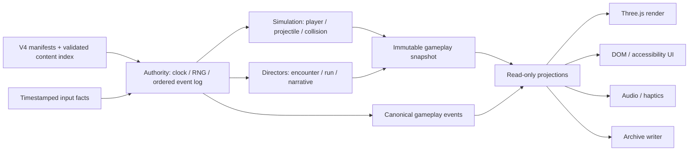

# 1bit STG 工业化架构基线

状态：`FOUNDATION / WIP`

基线日期：2026-07-18

适用范围：`stg-dev/` 与只读内容源 `../1bit-stg-complete-asset-kit-v4/`

本文是工程决策基线，不是完成声明。当前工程已经具备默认 RUN、Three.js Pattern Lab、固定 120Hz 仿真、基础输入/音频/PWA、Run Director，以及纯函数 RunMemory/ghost recorder；它还没有达到完整工业 STG 所需的内容校验、V4 事件全量同构、完整 Boss/弹体生命周期、叙事状态机、archive/restore 和性能门禁。

## 1. 权威来源

权威从高到低如下：

1. `../1bit-stg-complete-asset-kit-v4/manifests/**`：V4 数据契约；
2. `../1bit-stg-complete-asset-kit-v4/runtime/**`：V4 60Hz 参考运行时与行为 oracle；
3. `src/game/**`：本工程的 120Hz 游戏实现；
4. Three.js、DOM、音频、触觉和 PWA：只读投影，不拥有玩法事实。

当实现和 manifest 冲突时，先修实现或提出有证据的 Extension ADR，不得静默修饰数据。V4 素材包在应用运行时视为只读；开发服务器通过 `vite.config.ts` 的 `server.fs.allow: [".."]` 读取它。

当前内容入口仍由 `src/main.ts` 直接 import JSON，并以 TypeScript assertion 接收。这适合 Lab，不是最终内容边界。P0 必须引入 content index、schema 校验、引用完整性检查与 SHA-256 digest，构建在任何未知 ID、孤儿引用、版本不匹配或 hash 漂移时失败。

## 2. 权威核心与投影分离

### 2.1 核心可以做什么

- 消费带 tick 的输入事实；
- 推进确定性时钟和 RNG；
- 改变玩家、弹体、房间、Boss、叙事与 Run 状态；
- 产生 72 个 V4 canonical event 中定义的事件；
- 形成不可变 snapshot、event trace、run memory 与 archive record。

### 2.2 投影只能做什么

- 根据 snapshot 或事件更新画面、UI、声音和触觉；
- Reduced Motion、Flash-Off 等可替换/缩短视觉，但不得改变事件时间、payload、顺序、碰撞或 RNG；
- 失败时降级或静默，例如浏览器拒绝手柄振动；
- 不得调用 gameplay command、推进 narrative transition、生成碰撞体或回写 ledger。

`src/game/renderer.ts`、`src/game/audio.ts` 和 `InputManager.pulse()` 已按这个方向工作，但目前没有编译期依赖门禁。P0 要用目录依赖测试或 lint rule 禁止 `projection/presentation` 反向 import `authority/simulation/directors` 的 command API。

## 3. 目标模块边界

| 模块 | 单一职责 | 允许依赖 | 当前映射/状态 |
|---|---|---|---|
| `app/` | 启动、RUN/LAB 模式、装配 | 全部公开端口 | 目前集中在 `src/main.ts`，待拆分 |
| `content/` | schema、索引、ID、hash、provenance | V4 JSON/asset | 未实现；当前为直接 JSON import |
| `authority/` | 120Hz master tick、60Hz due-time、RNG、事件排序 | `content/` | 固定循环存在；双速率/全事件未实现 |
| `simulation/` | 玩家、弹体、碰撞、池、空间查询 | `authority/`, `content/` | 目前为 `GameSimulation`，功能性基础 |
| `gameplay/` | 48 pattern、12 operator、laser、safe gap | `simulation/`, `content/` | compiler 可运行；未完成 oracle parity |
| `directors/` | encounter、room、run、boss 调度 | `authority/`, `gameplay/` | `RunDirector` 为 WIP 骨架 |
| `narrative/` | 16-state machine、witness、snapshot、cross-run | `authority/`, `directors/` | 未完成；RunMemory 基础 WIP |
| `projection/` | 将事件/snapshot 转成无副作用 view model | 核心只读端口 | 尚未独立成层 |
| `presentation/` | Three.js、DOM、audio、haptics | `projection/` | `renderer.ts`、`audio.ts` 已有基础 |
| `platform/` | keyboard/pointer/gamepad、PWA、IndexedDB | app 端口 | 输入/PWA 已有；IndexedDB 未完成 |
| `testkit/` | trace fixture、oracle、fake clock、benchmark | 核心公开端口 | 零散 fixture 已有，待集中 |

目标不是为了目录数量而拆分。每次拆分必须消除一个权威歧义、测试盲区或循环依赖；否则保持现状，遵循“做减法”。

## 4. ADR-001：120Hz master 与 V4 60Hz runtime 共存

状态：`ACCEPTED DESIGN / IMPLEMENTATION P0`

### 背景

- 48 个 executable pattern 声明 `tickHz: 120`；现有 `src/main.ts` 与 `GameSimulation` 以 `1000 / 120ms` 固定步进。
- V4 `runtime-contract-v4.json` 的参考步长是 `16.6666666667ms`，即 60Hz。
- 把全部系统粗暴改成 60Hz 会损失 pattern 与碰撞精度；把 V4 reference machine 粗暴调用到 120Hz 会改变 canonical timing 和 trace。

### 决策

1. 120Hz 是唯一 master tick。核心内部以整数 `tick120` 保存时间，不以不断累加的浮点毫秒作为身份。
2. V4 60Hz runtime machine 是 due-time consumer：每两个 master tick 推进一步，边界为 `tick120 % 2 === 0`。
3. 时间序列化为 `tick120 × 1000 / 120`；比较与排序使用整数 tick、domain priority 和 monotonic sequence，不比较近似浮点数。
4. 浏览器 `requestAnimationFrame` 只提供 elapsed budget；权威核心逐 tick 消耗 accumulator。大 delta 必须遍历每个被跨越的权威边界，最多遵守 V4 的 `maximumBoundariesPerAdvance: 1024`，不得直接跳到最终状态。
5. Pause 冻结 gameplay clock；render/audio clock 可继续做非权威过渡，但恢复时不得吸收 pause 期间 wall time。
6. 同 seed、初始状态与按 tick 输入必须产生相同事件 ID、tick、payload 与顺序；帧率、Reduced Motion、Flash-Off、音频/触觉可用性不参与 RNG。

### 为什么不采用其他方案

- 全部 60Hz：不能满足 pattern manifest 的 120Hz authority，也减弱高速弹体的可重放性。
- 全部 120Hz：破坏 V4 参考 runtime 的 due-time 与 trace parity。
- 两个各自累加浮点时钟：长 Run 后会漂移，并在同 timestamp 上产生不稳定顺序。

### 完成定义

- 有 dual-rate scheduler 单元测试与长时间无漂移测试；
- V4 reference runtime 与本工程 adapter 在 canonical fixtures 上 trace parity；
- 30/60/120/144Hz render cadence 和 100ms large delta 产生同一 gameplay trace；
- pause/resume、后台恢复和 PWA 离线启动不改变权威 tick。

## 5. ADR-002：同 timestamp 的提交顺序

状态：`V4 ACCEPTED / IMPLEMENTATION PARTIAL`

任何相同权威 timestamp 的事件必须按以下顺序处理：

1. `collision-disable`
2. `state-or-damage-commit`
3. `collision-enable`
4. `entity-spawn`
5. `feedback-dispatch`

实现要求：

- 状态先变，事件后观察；fatal/non-fatal damage 只能有一个原子分支；
- 碰撞由 owner lease 管理，不允许 presentation 直接 toggle；
- 一帧多个命中候选先稳定排序，再至多提交一个合法玩家伤害；
- spawn 在该 timestamp 的 collision/state commit 后出现，不能倒推触发已完成的命中；
- feedback 永远最后，且无法生成 gameplay event；
- 排序 key 固定为 `(tick120, phasePriority, entityStableId, localSequence)`。

现有 `GameSimulation` 已覆盖部分伤害原子性和恢复边界，但尚未实现 72 canonical events 的统一队列，也未完成 projectile lifecycle/pool/swept collision，因此不能宣称完全符合本 ADR。

## 6. 确定性、快照与持久化

- Run RNG 使用 `mulberry32-v1`；seed、输入 trace、content digest、engine version 必须进入 replay header。
- 任何 `Math.random()`、`Date.now()`、设备像素比或 render delta 都不得进入权威状态。
- Snapshot 负责“观察—序列化—呈现当前 Run”；Archive 负责不可变持久化；Restore 只在下一 Run hydrate。三者不得合并。
- Cross-run material 的顺序是 `overrideScar → deathTrace → burnIn → actual ghost route → ghostResidue → witness orientation → returnInput`。
- 存储失败不能重写当前 Run 结果；应保留内存 snapshot、显示非评价性状态并允许导出诊断包。
- IndexedDB 的 schema/version migration、原子 transaction、quota/损坏恢复属于 P1；P0 先完成纯函数 recorder、canonical serializer 与 hash。

## 7. 内容与发布边界

生产构建必须记录：

- V4 `schemaVersion`、package/content digest；
- Bun 1.3.14 与 Three.js/Vite/TypeScript 精确版本；
- Git commit 与 build mode；
- Extension ADR ID 及其 asset digest；
- 48 pattern、72 event、8 Boss × 3 phase、8 laser 的引用检查结果。

任何 V4 外扩展都必须先通过 [CONTENT_EXTENSION_ZH.md](./CONTENT_EXTENSION_ZH.md)。完整状态与剩余施工见 [ROADMAP_ZH.md](./ROADMAP_ZH.md)，玩法语义见 [GAME_DESIGN_ZH.md](./GAME_DESIGN_ZH.md)，验收见 [TESTING_ZH.md](./TESTING_ZH.md)。
